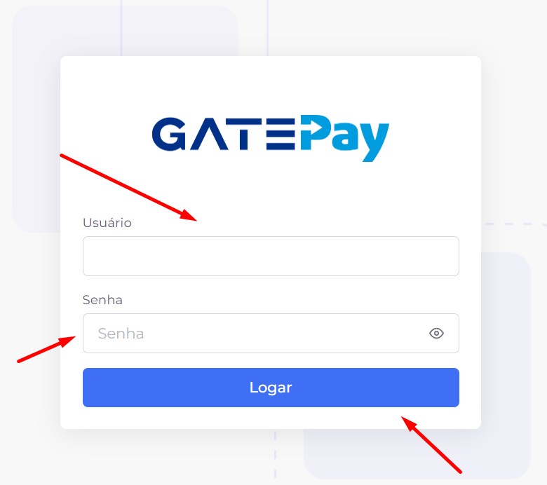

# 🔐 Tela de Login

Bem-vindo à tela de login do **GatePay**. Esta é a porta de entrada para o sistema e o primeiro passo para acessar as funcionalidades disponíveis conforme o perfil do usuário.

## 📌 Visão Geral

A tela de login permite que usuários autenticados entrem no sistema de forma segura. Após validar as credenciais, o usuário passa a ter acesso aos módulos e recursos autorizados para o seu perfil.

## 🚀 Como acessar o sistema

Para realizar o login, siga estes passos:

1. Acesse a tela inicial do sistema.
2. Informe o nome de usuário no campo correspondente.
3. Informe a senha no campo de senha.
4. Clique em **Logar**.
5. Se as credenciais estiverem corretas, o sistema abrirá o ambiente principal para o usuário.

## 📝 Campos da tela

### 👤 Usuário

Campo utilizado para informar o usuário cadastrado no sistema.

**Obrigatório:** Sim.

### 🔒 Senha

Campo destinado à senha de acesso do usuário.

**Obrigatório:** Sim.

**Observação:** O ícone 👁️ permite exibir ou ocultar a senha digitada.

## ⚙️ Ações disponíveis

### 🔓 Logar

Realiza a autenticação do usuário. Caso as credenciais sejam válidas, o sistema libera o acesso ao ambiente do GatePay.

## 🔒 Regras importantes

### ⏳ Tempo de inatividade

Por motivos de segurança, o sistema encerra automaticamente a sessão do usuário após **20 minutos de inatividade**. Para continuar utilizando o sistema, será necessário realizar um novo login.

### 👤 Sessão única

Um mesmo usuário pode manter apenas **uma sessão ativa** por vez. Caso seja iniciado um novo login em outro dispositivo ou navegador, a sessão anterior será encerrada automaticamente.

## 🚫 Mensagens comuns

### Usuário ou senha inválidos

Exibida quando as credenciais informadas não correspondem a um usuário válido.

### Sessão já iniciada

Exibida quando o usuário já possui uma sessão ativa e o sistema bloqueia um novo acesso simultâneo.