## 📌 Visão Geral

O módulo **Cobrança** é o ambiente onde os operadores realizam o atendimento aos devedores e conduzem todo o processo de negociação dos contratos.

Os contratos exibidos nesta tela são definidos pelas estratégias configuradas no módulo **Estratégia**. Conforme os filtros entram em execução, os contratos são distribuídos aos operadores para atendimento, um de cada vez.

Durante o atendimento, o operador possui acesso a todas as informações necessárias para conduzir a negociação, incluindo:

- Dados cadastrais do devedor;
- Contratos vinculados;
- Campanhas ativas;
- Telefones, endereços e e-mails;
- Informações jurídicas;
- Documentos anexados;
- Histórico de atendimentos e eventos;
- Parcelas do contrato;
- Acordos realizados ou em andamento.

Além da consulta das informações, o operador também pode executar diversas ações diretamente nesta tela, como:

- Cadastrar ou atualizar telefones, endereços e e-mails;
- Anexar documentos ao contrato;
- Registrar informações jurídicas;
- Criar novos acordos;
- Consultar o histórico completo do contrato;
- Registrar o resultado do atendimento por meio de um acionamento.

Ao finalizar o atendimento, um acionamento é aplicado ao contrato, registrando o resultado da negociação e permitindo que o sistema disponibilize o próximo contrato da fila para o operador.

## 🔄 Fluxo de atendimento

De forma resumida, o atendimento segue o seguinte fluxo:

1. O sistema entrega um contrato ao operador conforme as estratégias configuradas.
2. O operador consulta as informações do devedor e do contrato.
3. São realizadas as tentativas de contato e a negociação.
4. Caso necessário, o operador atualiza cadastros, anexa documentos, registra informações jurídicas ou cria um acordo.
5. O atendimento é finalizado com um acionamento, registrando o resultado da interação.
6. O sistema disponibiliza automaticamente o próximo contrato da fila para atendimento.

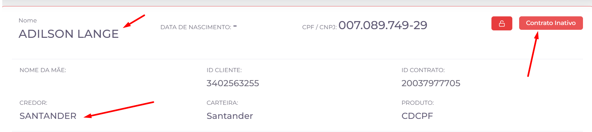

# 👤 Informações do Contrato

Esta seção apresenta as principais informações do contrato e do cliente que será atendido pelo operador. Os dados exibidos servem como referência durante o contato e auxiliam na identificação do cliente e da operação em andamento.

## 📋 Informações Exibidas

### 👤 Nome

Exibe o nome do cliente vinculado ao contrato.

### 🆔 CPF / CNPJ

Exibe o documento de identificação do cliente.

### 🎂 Data de Nascimento

Exibe a data de nascimento do cliente, quando disponível.

### 👩 Nome da Mãe

Exibe o nome da mãe do cliente, podendo ser utilizado para confirmação de identidade durante o atendimento.

### 🏦 Credor

Identifica a instituição credora responsável pelo contrato.

### 💼 Carteira

Exibe a carteira à qual o contrato pertence.

### 🆔 ID Cliente

Identificador único do cliente dentro do sistema.

### 📄 ID Contrato

Identificador único do contrato.

### 📦 Produto

Exibe o produto financeiro relacionado ao contrato.

## ⚙️ Indicadores

### 🔒 Contrato Bloqueado

O ícone de cadeado indica que o contrato possui alguma restrição operacional. Quando aplicável, o operador deverá respeitar as regras definidas para esse bloqueio.

<!-- > **Observação:** Precisamos confirmar exatamente em quais situações o cadeado é exibido para documentar essa regra corretamente.
>  -->

### 🚫 Contrato Inativo

Indica que o contrato está inativo e não pode ser tratado normalmente durante o atendimento.

<!-- > **Observação:** Também seria interessante documentar quando um contrato passa a ser considerado inativo.
>  -->

# 📄 Contratos e Campanhas

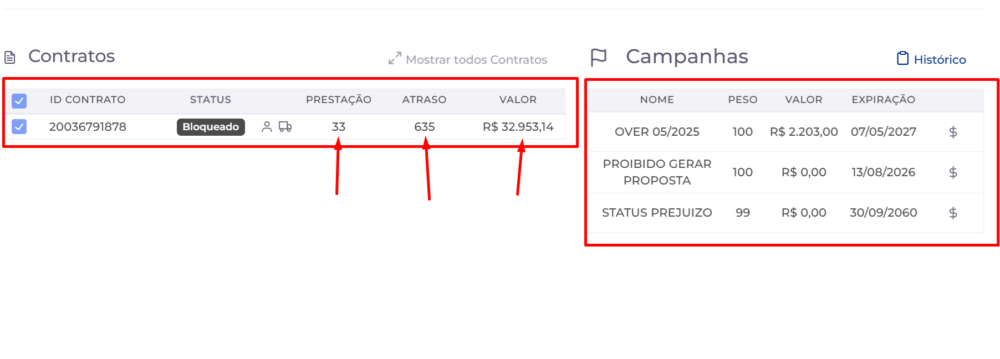

Esta seção apresenta os contratos e as campanhas vinculadas ao cliente selecionado, permitindo que o operador consulte informações importantes para o atendimento e identifique oportunidades de negociação.

## 📄 Contratos

A listagem de contratos exibe todos os contratos associados ao cliente, juntamente com informações relevantes para a análise durante o atendimento.

### Informações Exibidas

- 🆔 **ID Contrato:** Identificador único do contrato.
- 📌 **Status:** Situação atual do contrato.
- 📅 **Prestação:** Quantidade de prestações do contrato.
- ⏳ **Atraso:** Quantidade de dias em atraso.
- 💰 **Valor:** Valor atualizado do contrato.

## ⚙️ Ações Disponíveis

### 🚚 Consultar Garantia

O ícone em formato de caminhão permite consultar as informações da garantia vinculada ao contrato.

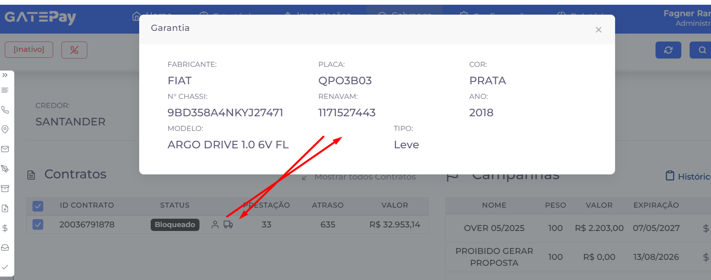

Ao selecioná-lo, o sistema abre uma janela com os dados do veículo utilizado como garantia da operação.

As informações exibidas incluem:

- 🏭 Fabricante
- 🚗 Modelo
- 🔖 Placa
- 🆔 Chassi
- 📄 RENAVAM
- 🎨 Cor
- 📅 Ano
- 🚙 Tipo do veículo

> **Observação:** O ícone é exibido apenas para contratos que possuem um veículo cadastrado como garantia.
> 

## 🎯 Campanhas

A listagem de campanhas apresenta as campanhas vinculadas ao contrato selecionado.

As informações disponíveis permitem ao operador identificar quais campanhas estão ativas para aquele contrato e consultar seus principais dados.

### Informações Exibidas

- 📝 **Nome:** Nome da campanha.
- ⚖️ **Peso:** Prioridade atribuída à campanha.
- 💰 **Valor:** Valor relacionado à campanha.
- 📅 **Expiração:** Data de encerramento da campanha.

## ⚙️ Ações Disponíveis
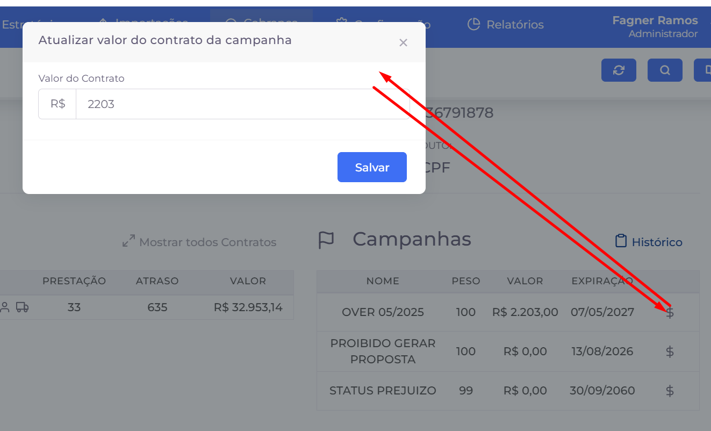

- **💲 Alterar valor da campanha**: Permite atualizar o valor da campanha especificamente para o contrato selecionado. Ao acionar o ícone de cifrão, o sistema abre uma janela para informar o novo valor do contrato na campanha e salvar a alteração.

### 💡 Observação

Quando um cliente possui mais de um contrato, o operador pode alternar entre eles para consultar suas informações e verificar as campanhas vinculadas antes de iniciar a negociação.

# 📞 Telefones

Esta seção apresenta todos os telefones vinculados ao devedor, permitindo ao operador identificar os melhores números para contato durante a negociação.

Além da consulta, o operador pode cadastrar novos telefones, visualizar todos os números disponíveis e registrar informações que auxiliem os próximos atendimentos.

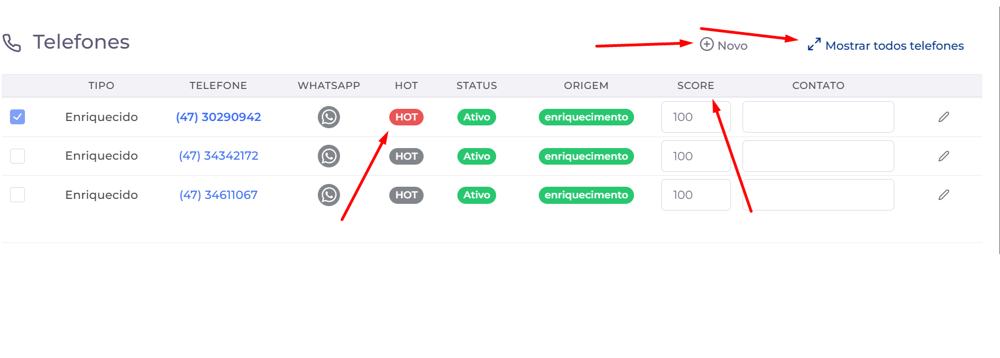

## 📋 Informações Exibidas

### ☎️ Tipo

Indica a categoria do telefone, como residencial, celular, comercial ou outros.

### 📱 Telefone

Exibe o número de telefone cadastrado para contato com o devedor.

### 💬 WhatsApp

Indica se o número possui WhatsApp cadastrado.

### 🔥 Telefone HOT

Identifica telefones pertencentes ao **devedor**, destacando números considerados **HOT** para contato.

Quando o telefone é classificado como **HOT**, o indicador é apresentado com **fundo vermelho**, facilitando sua identificação na lista de telefones.

### 📌 Status

Informa se o telefone está ativo para utilização durante os atendimentos.

### 📥 Origem

Indica a origem do telefone cadastrado, como uma importação de dados ou outro processo do sistema.

### 📊 Score

Representa a confiabilidade do telefone com base no histórico de utilização pelos operadores.

A pontuação varia de **0 a 100**, onde:

- 🟢 **100:** Alta probabilidade de contato.
- 🟡 **Valores intermediários:** Probabilidade moderada.
- 🔴 **0:** Baixa probabilidade de contato.

Esse indicador auxilia o operador na priorização dos números durante o atendimento.

### 📝 Contato

Campo utilizado para registrar informações sobre o telefone.

Pode ser preenchido com o nome da pessoa que costuma atender o número ou qualquer observação relevante para auxiliar futuros atendimentos.

## ⚙️ Ações Disponíveis

### ➕ Novo

Permite cadastrar um novo telefone para o devedor.

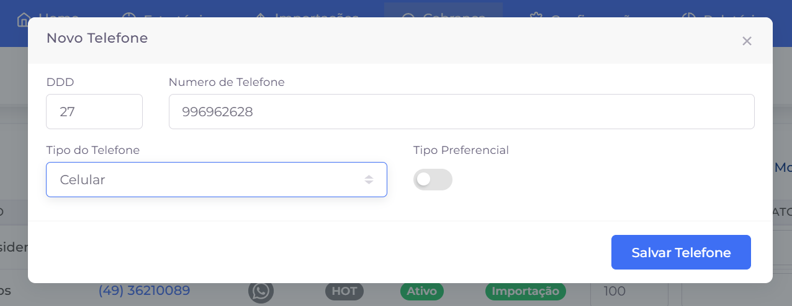

### 🔍 Mostrar Todos os Telefones

Exibe todos os telefones cadastrados para o devedor, inclusive aqueles que não estão sendo apresentados na listagem principal.

### ✏️ Editar Telefone

Permite alterar as informações do telefone selecionado, como observações ou outros dados cadastrados.

# 📍 Endereços

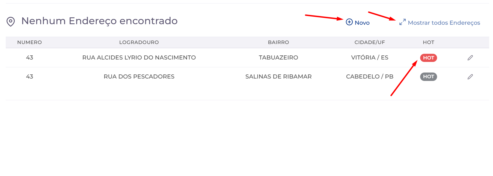

Esta seção apresenta os endereços vinculados ao devedor, permitindo ao operador consultar informações de localização e, quando necessário, cadastrar ou atualizar novos endereços.

Os endereços também podem auxiliar na localização de bens vinculados ao contrato, como veículos dados em garantia.

## 📋 Informações Exibidas

### 🏠 Número

Exibe o número do imóvel cadastrado.

### 🛣️ Logradouro

Apresenta o nome da rua, avenida ou outro logradouro do endereço.

### 📍 Bairro

Exibe o bairro correspondente ao endereço cadastrado.

### 🌎 Cidade / UF

Apresenta a cidade e o estado (UF) do endereço.

### 🔥 HOT

Identifica endereços pertencentes ao **devedor**, classificando-os como **HOT**.
Quando o endereço é classificado como **HOT**, o indicador é apresentado com **fundo vermelho**, facilitando sua identificação na lista de endereços.

## ⚙️ Ações Disponíveis

### ➕ Novo

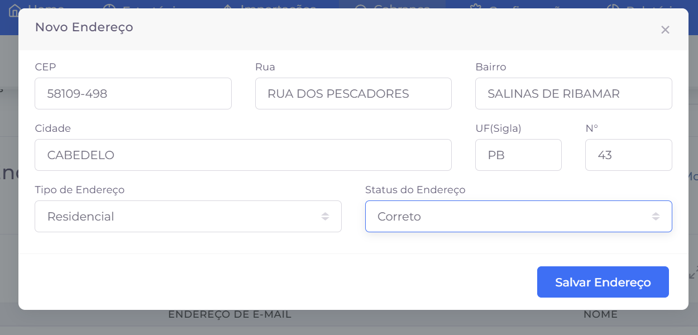

Permite cadastrar um novo endereço para o devedor.

Ao selecionar essa opção, o sistema abre uma janela para preenchimento das informações do endereço.

Os campos disponíveis são:

- 📮 CEP
- 🛣️ Rua
- 📍 Bairro
- 🌎 Cidade
- 🗺️ UF
- 🏠 Número
- 🏡 Tipo de Endereço
- ✔️ Status do Endereço

### ✏️ Editar Endereço

Permite alterar as informações de um endereço já cadastrado.

### 🔍 Mostrar Todos os Endereços

Exibe todos os endereços vinculados ao devedor, incluindo aqueles que não estão sendo apresentados na listagem principal.

# 📧 E-mails

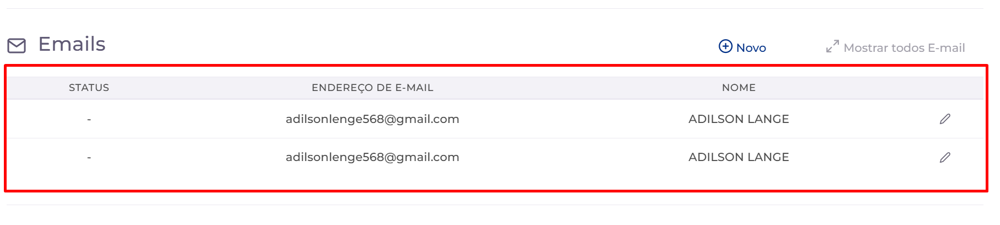

Esta seção apresenta os endereços de e-mail vinculados ao devedor, permitindo ao operador consultar, cadastrar e atualizar informações para ampliar os canais de contato durante a negociação.

Sempre que um novo e-mail for obtido durante o atendimento, ele poderá ser registrado para utilização em contatos futuros.

## 📋 Informações Exibidas

### 📌 Status

Indica a situação do endereço de e-mail cadastrado.

Os status disponíveis são:

- ✅ **Correto:** O endereço de e-mail é válido e pode ser utilizado.
- ❓ **Desconhecido:** Ainda não foi possível confirmar a validade do e-mail.
- ❌ **Incorreto:** O endereço informado é inválido ou não pertence ao devedor.
- ✔️ **Verificado:** O endereço foi confirmado como válido.

### 📧 Endereço de E-mail

Exibe o endereço de e-mail cadastrado para o devedor.

### 👤 Nome

Apresenta o nome associado ao endereço de e-mail.

## ⚙️ Ações Disponíveis

### ➕ Novo

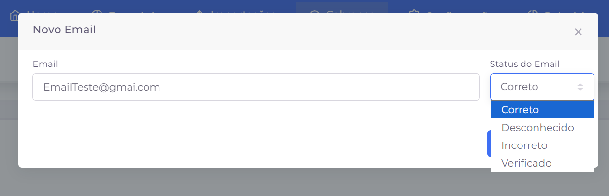

Permite cadastrar um novo endereço de e-mail para o devedor.

Ao selecionar essa opção, o sistema abre uma janela para preenchimento das seguintes informações:

- 📧 Endereço de E-mail
- 📌 Status do E-mail

### ✏️ Editar E-mail

Permite alterar as informações de um e-mail já cadastrado, como o endereço ou seu status.

### 🔍 Mostrar Todos os E-mails

Exibe todos os endereços de e-mail vinculados ao devedor, incluindo aqueles que não estão sendo apresentados na listagem principal.

# ⚖️ Jurídico

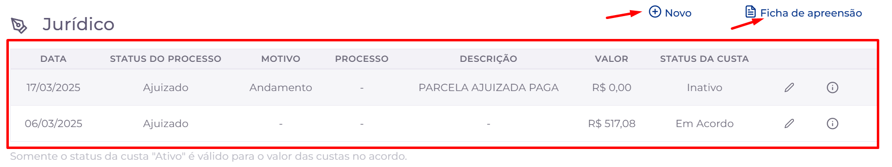

Esta seção reúne as informações jurídicas vinculadas ao contrato, permitindo ao operador consultar o andamento de processos judiciais, registrar novos eventos e acompanhar informações relacionadas às custas e movimentações do processo.

As informações apresentadas auxiliam no atendimento ao cliente e permitem consultar rapidamente a situação jurídica do contrato.

## 📋 Informações Exibidas

A listagem apresenta os principais eventos jurídicos registrados para o contrato.

### 📅 Data

Data em que o evento jurídico foi registrado.

### ⚖️ Status do Processo

Indica a situação atual do processo judicial.

### 📝 Motivo

Apresenta o motivo ou a classificação do evento registrado.

### 📄 Processo

Exibe o número do processo judicial, quando informado.

### 📖 Descrição

Descrição do evento jurídico registrado.

### 💰 Valor

Valor associado ao evento ou à custa processual.

### 📌 Status da Custa

Indica a situação da custa vinculada ao evento jurídico.

## ⚙️ Ações Disponíveis

### ➕ Novo

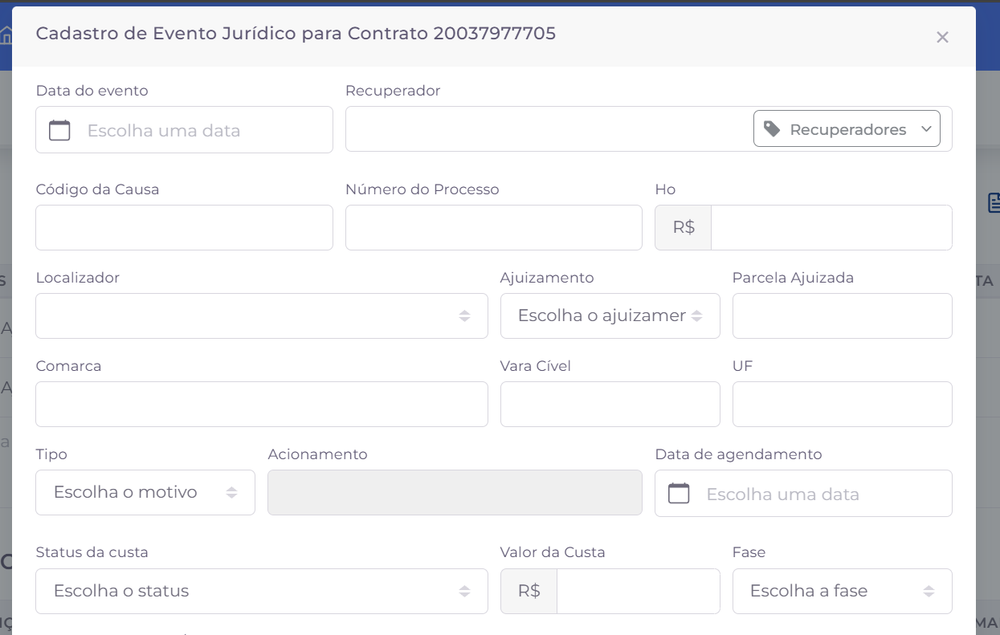

Permite registrar um novo evento jurídico para o contrato.

Ao selecionar essa opção, o sistema abre uma janela para preenchimento das informações do processo, como datas, número do processo, comarca, vara cível, tipo do evento, custas e demais informações relacionadas.

### 📄 Ficha de Apreensão

Permite gerar a **Ficha de Apreensão** do contrato em formato **PDF**.

O documento é aberto para visualização e pode ser baixado pelo usuário, quando necessário.

### ✏️ Editar Evento

Permite alterar as informações de um evento jurídico já registrado.

### ℹ️ Detalhes do Evento

Exibe uma janela com todas as informações cadastradas para o evento jurídico selecionado, permitindo consultar os dados do processo sem realizar alterações.

# 📁 Documentos

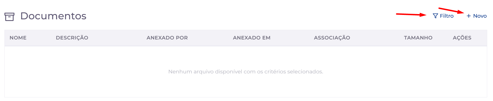

Esta seção permite consultar e gerenciar os documentos vinculados ao contrato ou ao processo de cobrança.

Os operadores podem anexar novos arquivos, localizar documentos já cadastrados e consultar informações como data de anexação, responsável pelo envio e tipo de associação.

## 📋 Informações Exibidas

### 📄 Nome

Exibe o nome do arquivo anexado.

### 📝 Descrição

Apresenta uma descrição do documento, quando informada.

### 👤 Anexado por

Identifica o usuário responsável pelo envio do documento.

### 📅 Anexado em

Exibe a data e a hora em que o documento foi anexado ao sistema.

### 🔗 Associação

Indica o processo ou documento ao qual o arquivo está vinculado.

### 💾 Tamanho

Exibe o tamanho do arquivo armazenado.

## ⚙️ Ações Disponíveis

### ➕ Novo

Permite anexar um ou mais documentos ao contrato.

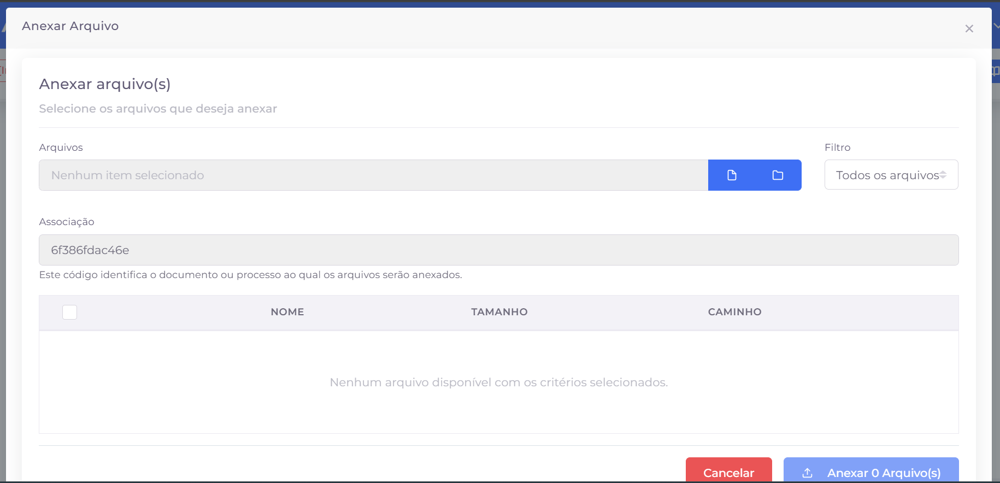

Ao selecionar essa opção, o sistema abre uma janela para seleção dos arquivos que serão enviados.

Durante o processo de anexação é possível:

- 📂 Selecionar um ou mais arquivos.
- 🔎 Filtrar os arquivos disponíveis por categoria.
- 🔗 Visualizar a associação que receberá os documentos.
- 📋 Selecionar os arquivos que serão anexados.
- ⬆️ Confirmar o envio para o contrato.

### 🔍 Exibir/Ocultar Filtros

Exibe ou oculta os filtros avançados da listagem, permitindo localizar documentos específicos com maior facilidade.

Os filtros disponíveis incluem:

- 📄 Nome do arquivo.
- 📝 Descrição.
- 📂 Tipo de documento.
- 👤 Usuário que realizou o anexo.

# 🤝 Acordos

Esta seção apresenta todos os acordos realizados para o contrato, permitindo ao operador acompanhar o histórico das negociações, consultar o status de cada acordo e verificar informações sobre pagamentos e parcelas.

Os acordos representam as negociações firmadas com o cliente para regularização da dívida.

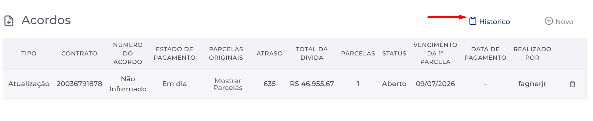

## 📋 Informações Exibidas

### 📌 Tipo

Indica o tipo de acordo realizado.

### 📄 Contrato

Identificador do contrato vinculado ao acordo.

### 🆔 Número do Acordo

Número identificador do acordo no sistema.

### 💳 Estado de Pagamento

Informa a situação do pagamento do acordo.

### 📑 Parcelas Originais

Permite consultar as parcelas que deram origem ao acordo.

### ⏳ Atraso

Quantidade de dias de atraso considerados no momento da negociação.

### 💰 Total da Dívida

Valor total da dívida utilizada para geração do acordo.

### 🔢 Parcelas

Quantidade de parcelas definidas no acordo.

### 📌 Status

Situação atual do acordo.

### 📅 Vencimento da 1ª Parcela

Data de vencimento da primeira parcela do acordo.

### 💵 Data de Pagamento

Data em que o pagamento foi realizado, quando aplicável.

### 👤 Realizado por

Usuário responsável pela criação do acordo.

## ⚙️ Ações Disponíveis

### ➕ Novo

Permite iniciar o processo de criação de um novo acordo para o contrato selecionado.

### 📋 Histórico do Acordo

Permite consultar os eventos registrados pelo sistema durante a criação e o gerenciamento do acordo.

Cada registro apresenta a **data e hora** do evento e uma **descrição detalhada da operação realizada**, permitindo acompanhar as principais alterações relacionadas ao acordo, como:

- 🤝 Criação do acordo;
- 💰 Valores e condições negociadas;
- 📉 Descontos aplicados;
- 📅 Vencimento da primeira parcela;
- 📄 Parcelas vinculadas ao acordo;
- 🔄 Alterações no status das parcelas.

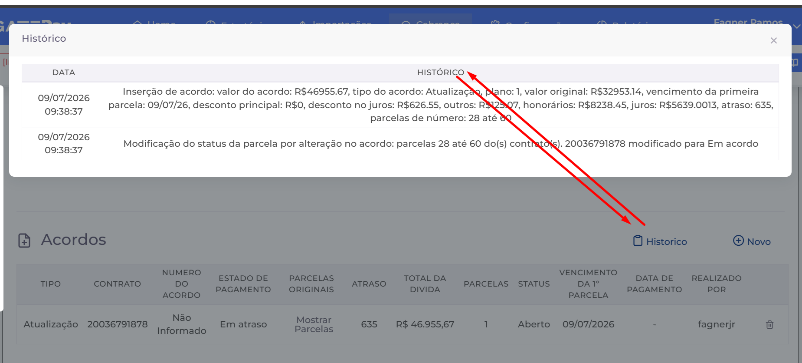

# 💰 Parcelas

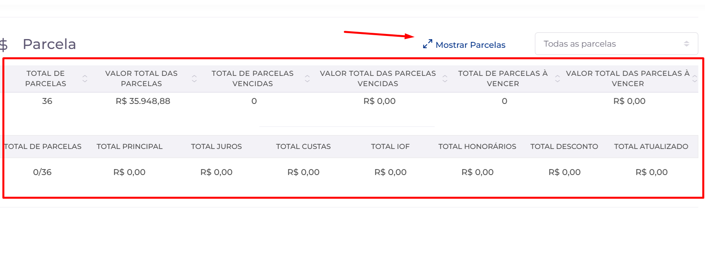

Esta seção permite consultar todas as parcelas vinculadas ao contrato, apresentando informações financeiras e o status de cada uma.

Os dados exibidos auxiliam o operador na análise da dívida e servem como base para a negociação com o cliente.

## 📋 Informações Exibidas

### 🔢 Nº da Parcela

Identifica o número da parcela dentro do contrato.

### 💵 Valor

Valor original da parcela.

### 📈 Juros

Valor de juros aplicado à parcela.

### 🧾 IOF

Valor de IOF incidente sobre a parcela.

### ⚠️ Multa

Valor da multa aplicada por atraso, quando houver.

### ⚖️ Honorários

Valor referente aos honorários vinculados à cobrança.

### 💼 Encargo

Valor dos encargos aplicados à parcela.

### 💲 Desconto

Valor de desconto concedido para a parcela.

### 🔄 Atualizado

Valor atualizado da parcela considerando os encargos aplicáveis.

### 📅 Data de Vencimento

Data de vencimento da parcela.

### 📌 Status

Situação atual da parcela, como paga, em aberto ou vencida.

### ⏳ Atraso

Quantidade de dias de atraso da parcela

### ⚙️ Funcionalidades Disponíveis

#### ☑️ Selecionar Parcelas

Permite selecionar as parcelas que serão utilizadas na criação de um acordo.

As parcelas selecionadas são consideradas durante o cálculo da negociação.

# 🤝 Criação de Acordo

Essa merece uma seção própria porque é uma funcionalidade grande.

## 📌 Visão Geral

A criação de acordos permite negociar uma ou mais parcelas do contrato, definindo descontos, parcelamento e demais condições da negociação antes da geração do acordo.

## 1️⃣ Seleção das Parcelas

O primeiro passo consiste em selecionar as parcelas que participarão da negociação.

O operador pode selecionar uma ou várias parcelas conforme as regras de negociação adotadas pelo escritório.

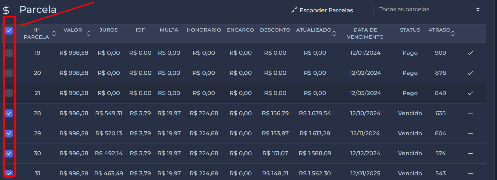

## 2️⃣ Aplicação de Descontos

Após selecionar as parcelas, é possível informar os descontos que serão aplicados.

Atualmente o sistema permite aplicar descontos sobre:

- 💰 Principal
- 📈 Juros

Após informar os percentuais desejados, utilize **Calcular** para atualizar os valores da negociação.

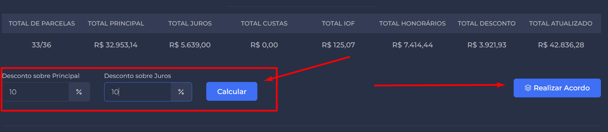

## 3️⃣ Configuração do Acordo

Depois do cálculo, o sistema apresenta a tela de criação do acordo.

Nessa etapa é possível definir informações como:

- Tipo do acordo;
- Quantidade de parcelas;
- Recuperador responsável;
- Status inicial do acordo;
- Data de vencimento da primeira parcela.

Além disso, o sistema apresenta um resumo financeiro contendo:

- Valor principal;
- Juros;
- Honorários;
- Custas;
- Outros encargos;
- Descontos aplicados;
- Valor total do acordo.

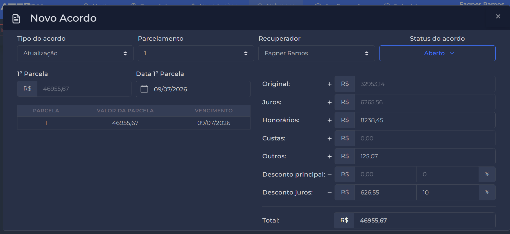

## 4️⃣ Gerar Acordo

Após conferir todas as informações, utilize o botão **Gerar Acordo** para concluir a negociação.

O sistema registrará o acordo e ele passará a ser exibido na seção **Acordos** do contrato.

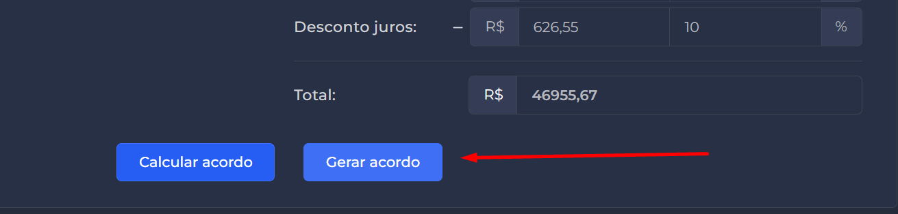

# 📜 Histórico

A seção **Histórico** permite consultar todas as interações realizadas durante o atendimento do contrato. Ela é dividida em duas abas: **Acionamentos** e **Eventos**, facilitando a consulta das ações do operador e das alterações registradas pelo sistema.

## 📞 Acionamentos

A aba **Acionamentos** exibe o histórico de todos os acionamentos realizados pelos operadores durante as tentativas de contato com o devedor.

Ao selecionar um registro na lista, seus detalhes são exibidos no painel ao lado, permitindo visualizar todas as informações registradas naquele atendimento.

Cada acionamento pode conter informações como:

- Data e hora do atendimento;
- Acionamento aplicado;
- Operador responsável;
- Número de telefone utilizado;
- Observações registradas;
- Dados complementares da negociação;
- Histórico completo daquele contato.

> Esta aba permite acompanhar toda a evolução das tentativas de negociação realizadas com o devedor.
> 

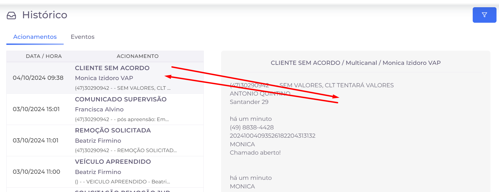

## ⚙️ Eventos

A aba **Eventos** apresenta um registro cronológico das alterações realizadas no contrato durante sua permanência no sistema.

Diferentemente da aba **Acionamentos**, que registra os contatos realizados pelos operadores, esta aba concentra os eventos operacionais e automáticos relacionados ao contrato.

Entre os eventos registrados estão:

- 🤝 Criação de acordos;
- 💰 Aplicação de descontos;
- 📄 Alteração do status das parcelas;
- 📅 Atualização dos dias de atraso;
- 📢 Confirmação de campanhas;
- 🔄 Outras alterações realizadas por usuários ou pelo próprio sistema.

Cada evento informa:

- Data e hora;
- Usuário responsável;
- Descrição detalhada da operação executada.

> Esta aba funciona como uma trilha de auditoria, permitindo acompanhar todas as modificações realizadas no contrato.
> 

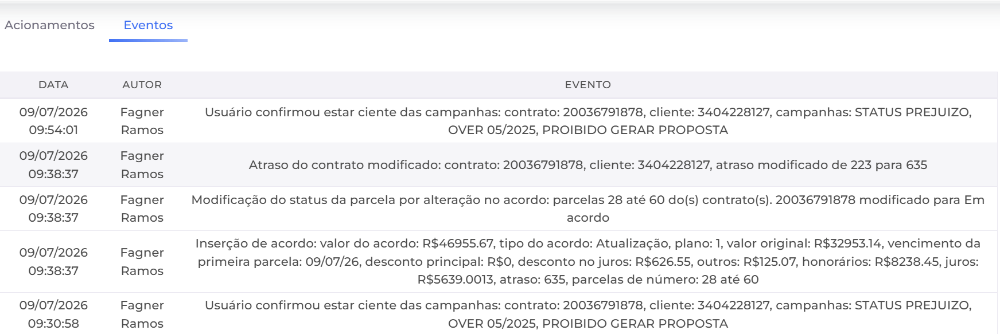

# ✅ Acionamentos

A seção **Acionamento** é utilizada para registrar o resultado do atendimento realizado pelo operador. Todo atendimento deve ser finalizado com um acionamento, que servirá como histórico da negociação e poderá influenciar as próximas etapas do processo de cobrança.

## Selecionando um acionamento

O campo **Acionamento** apresenta uma lista com todos os acionamentos disponíveis no sistema.

O operador pode:

- pesquisar pelo nome do acionamento;
- selecionar o acionamento desejado na lista;
- remover o acionamento selecionado, caso seja necessário escolher outro.

Após a seleção, o sistema exibe os campos relacionados ao acionamento escolhido.

> Cada acionamento representa o resultado de uma interação com o devedor, como acompanhamento de acordo, cliente sem contato, promessa de pagamento, entre outros.
> 

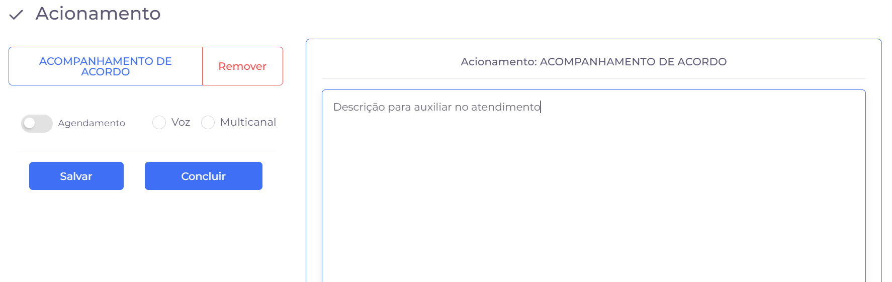

## Descrição do atendimento

Após selecionar o acionamento, o operador deve preencher o campo de descrição com as informações relevantes do atendimento.

Esse campo é utilizado para registrar observações como:

- resumo da conversa;
- informações fornecidas pelo devedor;
- detalhes da negociação;
- justificativas;
- qualquer informação importante para os próximos atendimentos.

Essas informações ficam registradas no histórico do contrato e podem ser consultadas posteriormente por outros operadores.

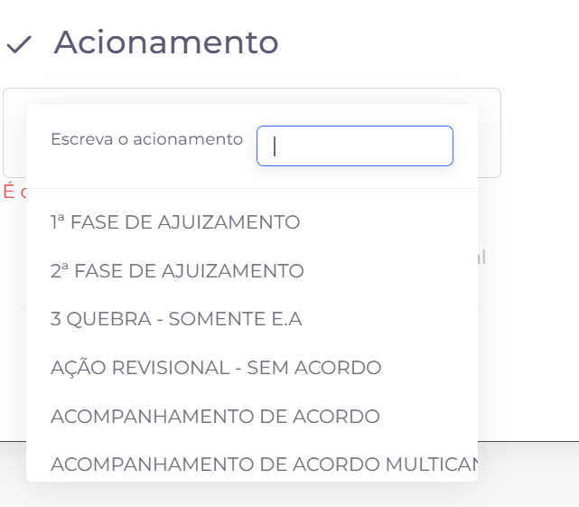

## Opções do acionamento

Dependendo do tipo de acionamento selecionado, o operador poderá habilitar algumas opções adicionais.

### 📅 Agendamento

Permite criar um retorno para uma data futura, registrando que um novo contato deverá ser realizado.

### 📞 Voz

Indica que o acionamento foi realizado por atendimento de voz (ligação telefônica).

### 💬 Multicanal

Indica que o atendimento foi realizado por outro canal de comunicação disponível na plataforma, como WhatsApp ou outros canais integrados.

> As opções disponíveis podem variar de acordo com as regras configuradas para cada acionamento.
> 

## Ações disponíveis

Ao final do atendimento, o operador possui duas opções:

### 💾 Salvar

Salva o acionamento e todas as informações preenchidas, mantendo o contrato aberto na tela para continuidade do atendimento, caso seja necessário.

### ✔️ Concluir

Finaliza o atendimento do contrato atual, registra o acionamento no histórico e libera o operador para receber o próximo contrato da fila de cobrança.