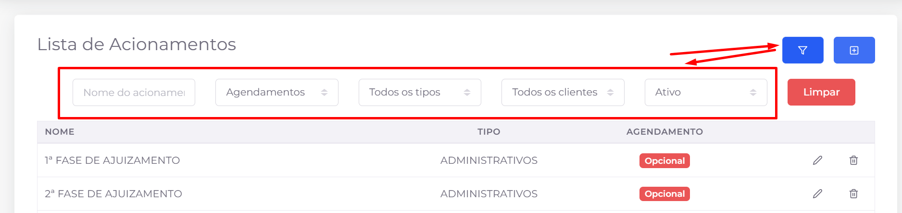
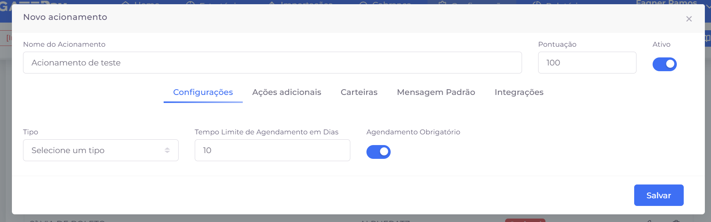
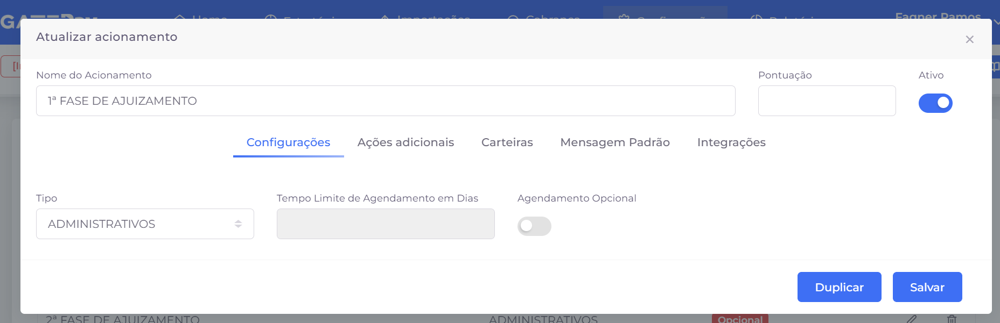
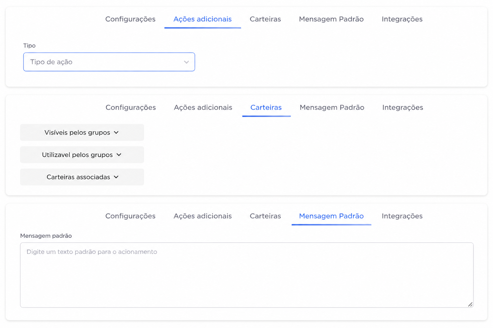

## 📌 Visão Geral

A tela **Acionamentos** é responsável pelo cadastro e gerenciamento dos acionamentos utilizados durante os atendimentos realizados no módulo **Cobrança**.

Um acionamento representa o resultado de uma interação entre o operador e o devedor, registrando o desfecho do atendimento e orientando as próximas etapas do processo de cobrança.

Os acionamentos cadastrados nesta tela ficam disponíveis para seleção pelos operadores durante o atendimento e também podem ser utilizados nos **Acionamentos em Massa**, permitindo aplicar o mesmo resultado a todos os contratos pertencentes a um filtro.

# 📋 Listagem de acionamentos

A tela apresenta uma listagem com todos os acionamentos cadastrados no sistema.

Para cada acionamento são exibidas informações como:

- **Nome:** Nome do acionamento.
- **Tipo:** Categoria à qual o acionamento pertence.
- **Agendamento:** Indica se o acionamento possui agendamento obrigatório, opcional ou não utiliza agendamento.

Além da consulta, a listagem permite editar e excluir acionamentos já cadastrados.

## 🔍 Filtros

Para facilitar a localização dos registros, a tela possui filtros que podem ser exibidos ou ocultados através do botão localizado no canto superior direito.

Os filtros disponíveis são:

- Nome do acionamento;
- Tipo;
- Categoria de agendamento;
- Cliente;
- Status (Ativo/Inativo).

O botão **Limpar** remove todos os filtros aplicados, retornando à listagem completa.

## ➕ Novo acionamento

O botão **Novo** abre o formulário para criação de um novo acionamento.

Após preencher as informações necessárias, basta clicar em **Salvar** para concluir o cadastro.

## ✏️ Editar acionamento

Ao clicar no ícone de edição, é aberto o formulário contendo todas as configurações do acionamento selecionado.

Além de alterar suas informações, também é possível utilizar a opção **Duplicar**, que cria uma cópia do acionamento atual, facilitando a criação de novos registros com configurações semelhantes.

## 🗑️ Excluir acionamento

O ícone de exclusão remove o acionamento do sistema.

Antes da exclusão, é exibida uma janela de confirmação para evitar remoções acidentais.

> Recomenda-se excluir um acionamento apenas quando ele não estiver mais sendo utilizado pelas estratégias ou pelos operadores de cobrança.
> 

# ⚙️ Cadastro do acionamento

O cadastro é dividido em várias abas, permitindo configurar desde informações básicas até integrações e comportamentos específicos.

Nesta seção será detalhada cada uma dessas configurações.

# ➕ Ações adicionais

Permite associar ações automáticas que serão executadas quando o acionamento for utilizado.

### Campo

**Tipo de ação**

Seleciona a ação adicional que será vinculada ao acionamento.

> **Observação:** As ações disponíveis dependem das configurações existentes no sistema
> 

# 💼 Carteiras

Define em quais carteiras e grupos o acionamento ficará disponível.

### Configurações

**Visíveis pelos grupos**

Define quais grupos de usuários poderão visualizar este acionamento.

**Utilizável pelos grupos**

Define quais grupos poderão utilizar efetivamente o acionamento durante os atendimentos.

**Carteiras associadas**

Permite restringir o acionamento para determinadas carteiras cadastradas no sistema.

> Essa configuração é útil quando determinados acionamentos devem estar disponíveis apenas para equipes ou carteiras específicas.
> 

# 💬 Mensagem Padrão

Permite cadastrar um texto padrão que será utilizado juntamente com o acionamento.

Esse recurso reduz a digitação durante o atendimento e ajuda a padronizar os registros realizados pelos operadores.

### Campo

**Mensagem padrão**

Texto que poderá ser utilizado automaticamente ao selecionar o acionamento.

