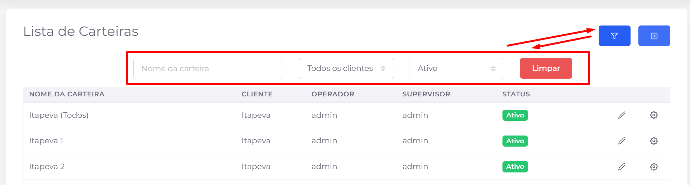
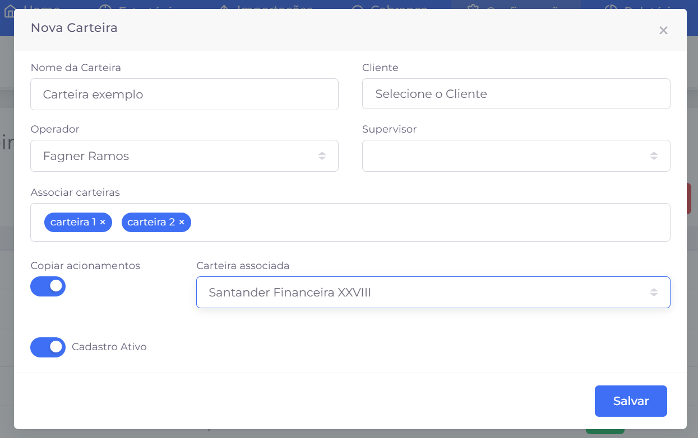

## 📌 Visão Geral

As carteiras são utilizadas para organizar e segmentar os contratos de um mesmo cliente (credor). Essa divisão permite separar operações por carteira, facilitando a distribuição do trabalho entre equipes, operadores ou estratégias específicas.

Exemplo: um cliente como **Santander** pode possuir carteiras distintas, como **Honda**, **Hyundai**, **Veículos**, entre outras, de acordo com sua necessidade operacional.

## 📋 Listagem de Carteiras

A listagem exibe todas as carteiras cadastradas no sistema, permitindo consultar suas principais informações e realizar ações de gerenciamento.

### Informações exibidas

- **Nome da Carteira** – Nome utilizado para identificar a carteira.
- **Cliente** – Credor ao qual a carteira pertence.
- **Operador** – Operador responsável pela carteira, quando configurado.
- **Supervisor** – Supervisor responsável pela carteira.
- **Status** – Situação da carteira (Ativa ou Inativa).

### 🔎 Filtros

Os filtros permitem localizar rapidamente uma carteira específica.

**Nome da carteira**

Pesquisa pelo nome da carteira.

**Cliente**

Filtra as carteiras pertencentes a um cliente específico.

**Status**

Exibe apenas carteiras com o status selecionado (Ativa ou Inativa).

**Limpar**

Remove todos os filtros aplicados e restaura a listagem completa.

### 🎛️ Ações

- **Mostrar/Ocultar filtros** – Exibe ou oculta a área de filtros da listagem.
- **Novo** – Abre o formulário para cadastro de uma nova carteira.
- **Editar** – Permite alterar as informações de uma carteira já cadastrada.
- **Configurações** – Abre as configurações específicas da carteira.
- **Paginação** – Quando a quantidade de registros excede o limite exibido por página, utilize o paginador localizado na parte inferior da tela para navegar entre as páginas da listagem.

# ✏️ Cadastro e Edição de Carteiras

O formulário de carteiras é utilizado tanto para o cadastro de novas carteiras quanto para a edição de carteiras existentes.

## Informações da carteira

### Nome da Carteira

Nome utilizado para identificar a carteira dentro do cliente (credor).

### Cliente

Define a qual cliente (credor) a carteira será vinculada.

### Operador

Permite definir o operador responsável pela carteira.

### Supervisor

Permite definir o supervisor responsável pelo acompanhamento da carteira.

### Associar carteiras

Permite relacionar outras carteiras à carteira em cadastro, criando associações entre elas quando necessário para a operação.

### Copiar acionamentos

Quando habilitado, permite copiar os acionamentos configurados de outra carteira.

Nesse caso, é necessário selecionar a **Carteira associada**, que servirá como origem para a cópia dos acionamentos.

### Cadastro Ativo

Define se a carteira permanecerá ativa para utilização no sistema.

- **Ativo:** a carteira poderá ser utilizada normalmente.
- **Inativo:** a carteira permanecerá cadastrada, porém indisponível para utilização.

### Salvar

Após concluir o preenchimento das informações, clique em **Salvar** para cadastrar uma nova carteira ou atualizar uma já existente.