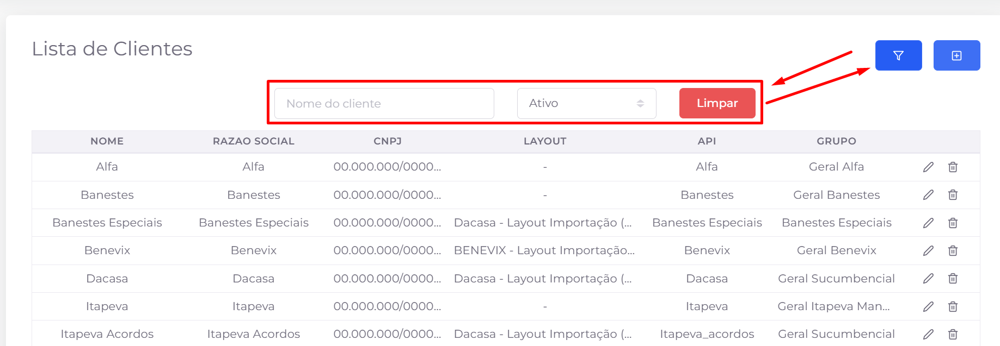
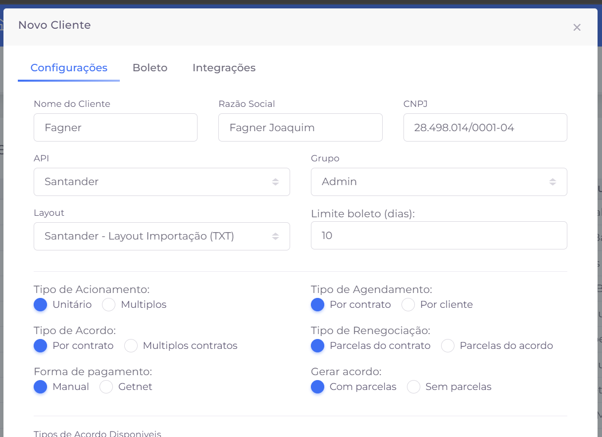
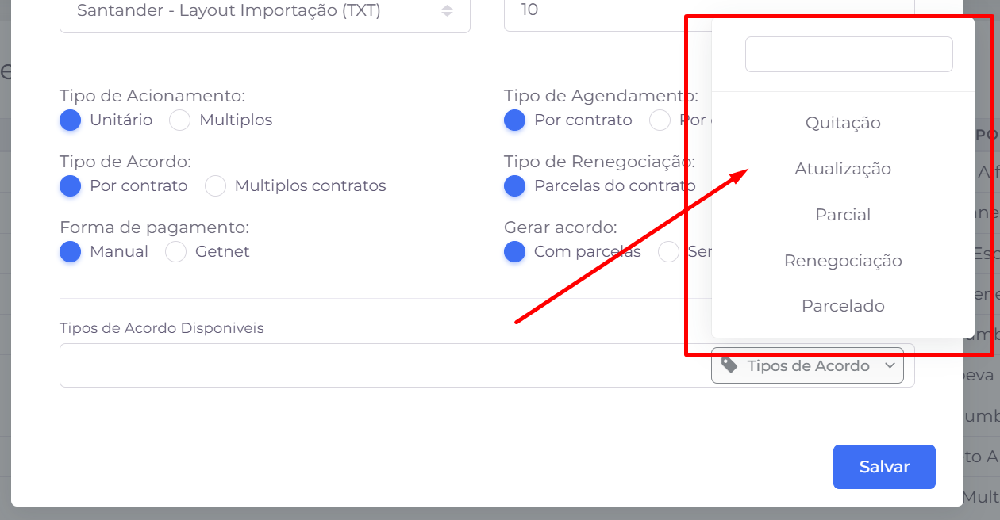
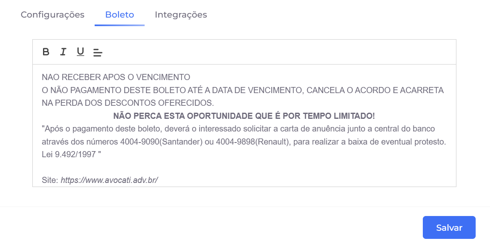
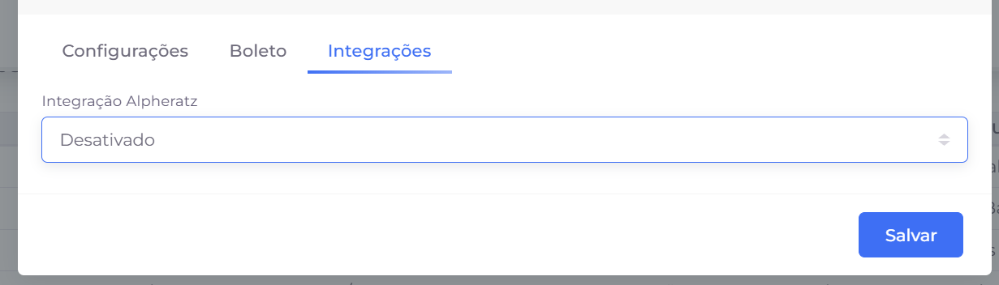

## 📌 Visão Geral

Permite gerenciar os clientes cadastrados na GatePay. Nesta tela é possível consultar, cadastrar, editar e excluir clientes utilizados pelo sistema.

## 📋 Listagem de Clientes

A listagem apresenta todos os clientes cadastrados, exibindo as principais informações para identificação e gerenciamento.

### Informações exibidas

- **Nome** – Nome do cliente.
- **Razão Social** – Razão social da empresa.
- **CNPJ** – Cadastro Nacional da Pessoa Jurídica.
- **Layout** – Layout de importação associado ao cliente, quando configurado.
- **API** – Integração (API) vinculada ao cliente.
- **Grupo** – Grupo ao qual o cliente pertence.

### 🔎 Filtros

Os filtros facilitam a localização de clientes específicos.

**Nome do cliente**

Permite pesquisar clientes pelo nome.

**Status**

Filtra os registros conforme a situação do cadastro (Ativo ou Inativo).

**Limpar**

Remove todos os filtros aplicados, retornando à listagem completa.

### 🎛️ Ações

**Mostrar/Ocultar filtros**

Exibe ou oculta a área de filtros avançados da listagem.

**Novo**

Abre o formulário para cadastro de um novo cliente.

**Editar**

Permite alterar as informações de um cliente já cadastrado.

**Excluir**

# ✏️ Cadastro e Edição de Clientes

O formulário de clientes é utilizado tanto para o cadastro de novos clientes quanto para a alteração de clientes já existentes. As informações são organizadas em três abas: **Configurações**, **Boleto** e **Integrações**.

## ⚙️ Aba Configurações

Nesta aba são definidas as informações principais e o comportamento do cliente dentro da GatePay.

### Dados cadastrais

- **Nome do Cliente** – Nome utilizado para identificar o cliente no sistema.
- **Razão Social** – Razão social da empresa.
- **CNPJ** – Cadastro Nacional da Pessoa Jurídica.
- **API** – API utilizada pelo cliente para integração com o sistema.
- **Grupo** – Grupo ao qual o cliente pertence.
- **Layout** – Layout de importação associado ao cliente.
- **Limite boleto (dias)** – Define o prazo máximo, em dias, para emissão ou vencimento dos boletos.

### Configurações de operação

Além dos dados cadastrais, é possível configurar o funcionamento do cliente na plataforma.

- **Tipo de Acionamento**
    - **Unitário:** o operador trabalha com um contrato por vez.
    - **Múltiplos:** permite trabalhar com vários contratos simultaneamente.
- **Tipo de Agendamento**
    - **Por contrato:** cada contrato possui seu próprio agendamento.
    - **Por cliente:** o agendamento é compartilhado entre os contratos do cliente.
- **Tipo de Acordo**
    - **Por contrato:** os acordos são realizados individualmente.
    - **Múltiplos contratos:** permite incluir mais de um contrato no mesmo acordo.
- **Tipo de Renegociação**
    - **Parcelas do contrato:** renegociação baseada nas parcelas originais.
    - **Parcelas do acordo:** renegociação das parcelas de um acordo existente.
- **Forma de Pagamento**
    - **Manual:** geração manual do pagamento.
    - **Getnet:** utilização da integração com a plataforma Getnet.
- **Gerar acordo**
    - **Com parcelas:** o acordo é criado contendo o parcelamento.
    - **Sem parcelas:** permite gerar acordos sem parcelamento.

### Tipos de acordo disponíveis

Nesta seção são definidos quais tipos de acordo estarão disponíveis para utilização pelo cliente.

Exemplos:

- Quitação
- Atualização
- Parcial
- Renegociação
- Parcelado

## 🧾 Aba Boleto

Permite configurar o texto padrão que será impresso ou exibido nos boletos emitidos para o cliente.

O editor permite aplicar formatação básica, como negrito, itálico, sublinhado e alinhamento do texto.

## 🔗 Aba Integrações

Centraliza as integrações específicas utilizadas pelo cliente.

Atualmente, é possível configurar a integração com o **Alpheratz**, definindo se ela permanecerá ativa ou desativada para o cliente.

### 💾 Salvando as alterações

Após concluir o preenchimento ou alterar as configurações desejadas, clique em **Salvar** para registrar as informações.