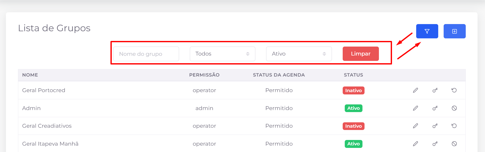
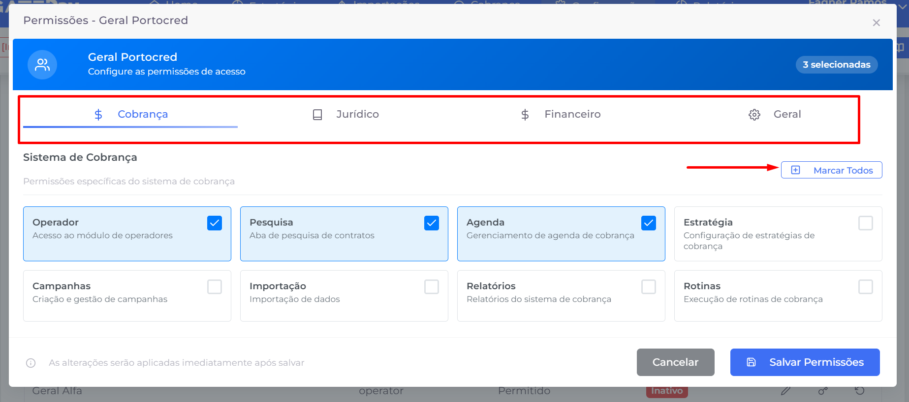
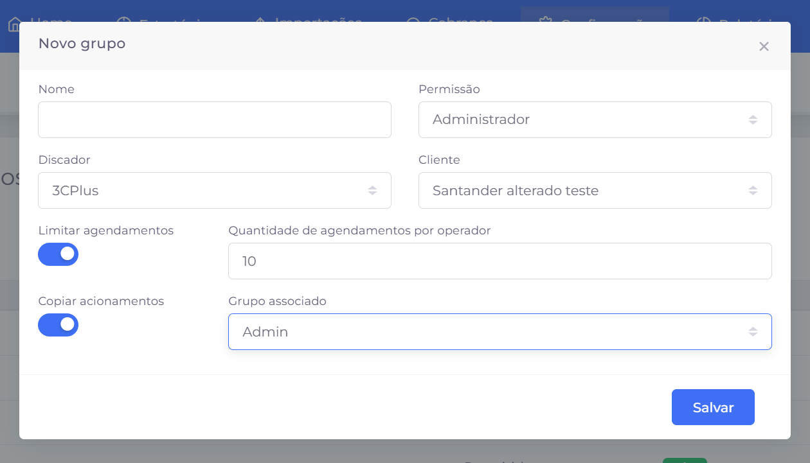

## 📌 Visão Geral

Permite gerenciar os grupos de usuários da GatePay, definindo permissões e níveis de acesso para cada perfil. Os grupos são utilizados para controlar quais funcionalidades e módulos estarão disponíveis para seus usuários.

## 📋 Listagem de Grupos

A listagem apresenta todos os grupos cadastrados no sistema, permitindo consultar suas principais informações e realizar ações administrativas.

### Informações exibidas

- **Nome** – Nome utilizado para identificar o grupo.
- **Permissão** – Perfil de acesso atribuído ao grupo (ex.: Administrador, Operador, Supervisor).
- **Status da Agenda** – Indica se os usuários do grupo possuem permissão para utilizar recursos relacionados à agenda.
- **Status** – Situação atual do grupo (Ativo ou Inativo).

### 🔎 Filtros

Os filtros permitem localizar rapidamente um grupo específico.

**Nome do grupo**

Pesquisa grupos pelo nome.

**Permissão**

Filtra os registros conforme o perfil de acesso do grupo.

**Status**

Exibe apenas grupos ativos ou inativos.

**Limpar**

Remove todos os filtros aplicados e retorna à listagem completa.

### 🎛️ Ações

**Mostrar/Ocultar filtros**

Exibe ou oculta a área de filtros da listagem.

**Novo**

Abre o formulário para cadastro de um novo grupo.

**Editar**

Permite alterar as informações de um grupo já cadastrado.

**Permissões do grupo**

Abre a tela de configuração de permissões, onde é possível definir quais módulos e funcionalidades estarão disponíveis para os usuários pertencentes ao grupo.

### 🔐 Configuração de Permissões

Após a criação do grupo, é possível acessar a tela de **Permissões do Grupo**, responsável por definir quais funcionalidades estarão disponíveis para os usuários vinculados a esse grupo.

> **Importante:** As permissões somente podem ser configuradas após o grupo ter sido criado.
> 

As permissões são organizadas por módulos do sistema, facilitando sua administração.

Os módulos disponíveis são:

- **Cobrança**
- **Jurídico**
- **Financeiro**
- **Geral**

Ao selecionar um módulo, são exibidas todas as permissões relacionadas àquela área do sistema.

### Seleção de permissões

Cada cartão representa uma funcionalidade da GatePay e pode ser habilitado ou desabilitado individualmente.

Exemplos de permissões:

- Operador
- Pesquisa
- Agenda
- Estratégia
- Campanhas
- Importação
- Relatórios
- Rotinas

As permissões marcadas estarão disponíveis para todos os usuários pertencentes ao grupo.

### Marcar Todos

O botão **Marcar Todos** seleciona todas as permissões disponíveis na aba atualmente aberta, agilizando a configuração de grupos com acesso completo ao módulo.

### Salvar Permissões

Após concluir a configuração das permissões, clique em **Salvar Permissões** para aplicar as alterações ao grupo.

> **Observação:** As alterações passam a valer para os usuários vinculados ao grupo após o salvamento das permissões.
> 

**Ativar/Inativar**

Altera o status do grupo, permitindo habilitar ou desabilitar sua utilização no sistema.

> **Observação:** A inativação de um grupo impede sua utilização em novos cadastros, preservando o histórico dos usuários já vinculados.
> 

**Paginação**

Quando a quantidade de registros excede o limite exibido por página, utilize o paginador localizado na parte inferior da tela para navegar entre as páginas da listagem.

## ➕ Criação e edição de grupos

A criação e a edição de grupos são realizadas pelo mesmo formulário. Nele são definidas as configurações básicas do grupo, seus limites operacionais e demais opções que influenciam o comportamento dos usuários vinculados a ele.

Os principais campos disponíveis são:

- **Nome:** identificação do grupo.
- **Permissão:** define o nível de acesso principal do grupo (por exemplo, Administrador ou Operador).
- **Discador:** seleciona o discador que será utilizado pelo grupo, quando aplicável.
- **Cliente:** associa o grupo a um cliente específico.

### Configurações adicionais

O formulário também possui algumas opções de configuração:

- **Limitar agendamentos:** quando habilitado, permite definir a quantidade máxima de agendamentos que cada operador do grupo poderá possuir simultaneamente.
- **Copiar acionamentos:** possibilita copiar todos os acionamentos já cadastrados de outro grupo, agilizando a configuração inicial.
- **Grupo associado:** disponível quando a cópia de acionamentos é habilitada, permitindo selecionar o grupo que servirá como modelo.

Após preencher as informações desejadas, clique em **Salvar** para concluir o cadastro ou atualizar o grupo.