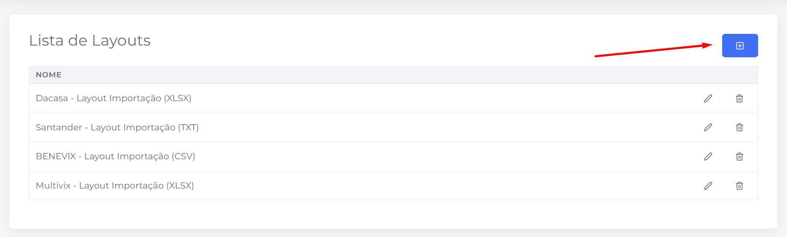
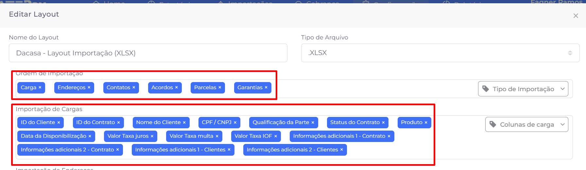
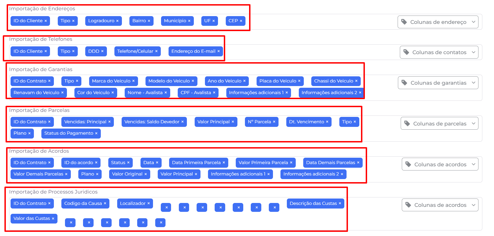
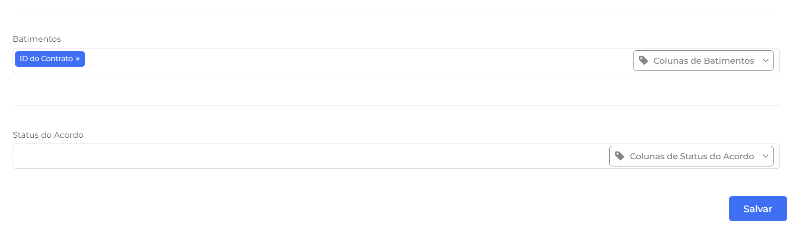

## 📌 Visão Geral

Os **layouts** definem quais informações serão exportadas pelo sistema e o formato do arquivo gerado. Eles são utilizados nas exportações de dados para clientes e integrações, permitindo personalizar tanto os campos presentes no arquivo quanto seu tipo de saída (CSV, XLSX, TXT, entre outros).

## Listagem

A tela apresenta todos os layouts cadastrados no sistema, permitindo consultar, criar, editar ou remover layouts utilizados nas exportações.

### Ações disponíveis

- **➕ Adicionar:** abre a tela para cadastro de um novo layout de exportação.
- **✏️ Editar:** permite alterar as configurações de um layout já existente.
- **🗑️ Excluir:** remove o layout selecionado do sistema.

### Informações exibidas

Para cada layout cadastrado é apresentada a seguinte informação:

- **Nome:** identifica o layout e, geralmente, informa o cliente e o tipo de arquivo utilizado na exportação.

> **Observação:** Os layouts são utilizados pelos módulos de exportação do sistema. Alterações em um layout podem impactar os arquivos gerados para integrações e clientes que utilizam essa configuração.
> 

# **➕ Criação e edição de Layouts**

A criação e a edição de layouts são realizadas na mesma tela. Nela, é possível definir o nome do layout, o tipo de arquivo que será gerado e quais informações farão parte da exportação.

Cada layout é organizado por **categorias de dados**, permitindo selecionar apenas as colunas que serão exportadas em cada seção.

## Configurações gerais

Antes de configurar as colunas do layout, devem ser definidos os seguintes campos:

- **Nome do layout:** identifica o layout que será utilizado nas exportações.
- **Tipo de arquivo:** define o formato do arquivo gerado, como **CSV**, **TXT** ou **XLSX**.

## Ordem de importação

A seção **Ordem de importação** determina a sequência em que os blocos de informações serão organizados no arquivo exportado.

É possível incluir ou remover categorias conforme a necessidade da integração.

## Configuração das colunas

Cada categoria possui um seletor próprio para adicionar ou remover as colunas que farão parte da exportação.

As principais categorias disponíveis são:

- **Carga**
- **Endereços**
- **Contatos**
- **Garantias**
- **Parcelas**
- **Acordos**
- **Processos Jurídicos**
- **Batimentos**
- **Status do Acordo**

Em cada categoria é possível:

- selecionar novas colunas por meio do campo de seleção localizado à direita;
- remover colunas já adicionadas clicando no **✖** exibido em cada item;
- definir exatamente quais informações serão exportadas para aquela categoria.

Dessa forma, cada layout pode ser totalmente personalizado conforme a necessidade do cliente ou da integração.

## Salvando o layout

Após concluir todas as configurações, clique em **Salvar** para gravar o layout.

O layout ficará disponível para utilização nos módulos de exportação do sistema.

