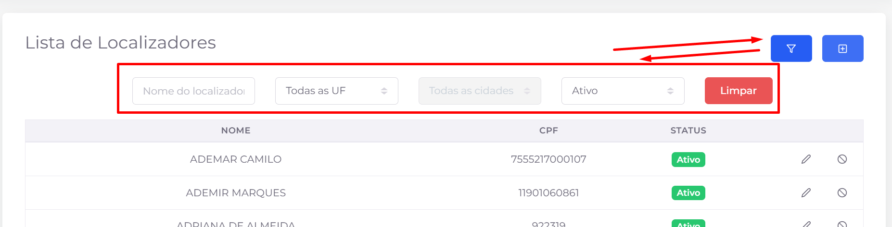
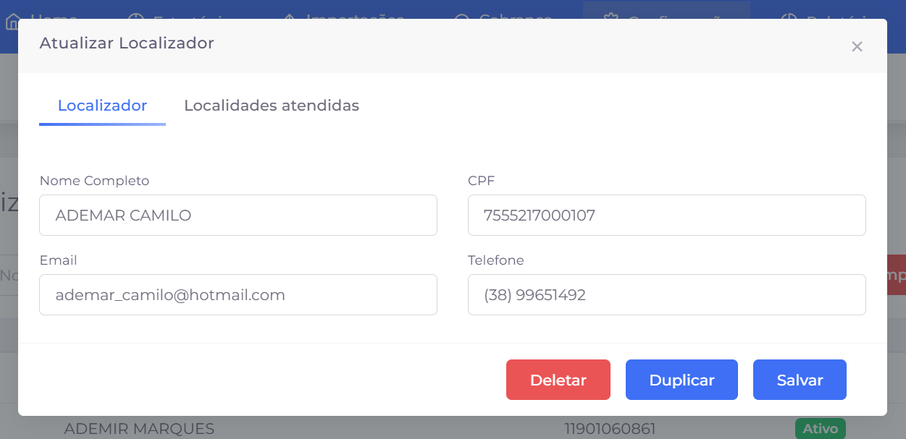
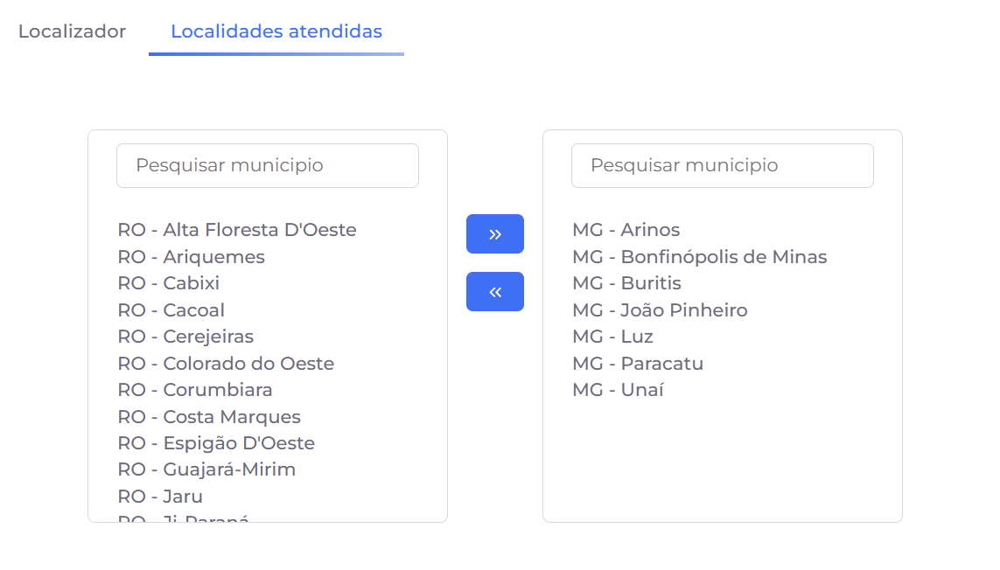

## 📌 Visão Geral

Os **localizadores** são os profissionais responsáveis por realizar buscas e levantamentos de informações que auxiliam na localização de pessoas ou bens, contribuindo para os processos de cobrança e recuperação.

## Listagem

A tela apresenta todos os localizadores cadastrados no sistema, permitindo consultar seus dados, localizar registros específicos e realizar ações administrativas.

### Ações disponíveis

- **🔎 Filtro:** exibe ou oculta a área de filtros para facilitar a localização dos registros.
- **➕ Adicionar:** abre a tela para cadastro de um novo localizador.
- **✏️ Editar:** permite alterar as informações do localizador selecionado.
- **🚫 Ativar/Desativar:** altera o status do localizador, permitindo habilitar ou impedir sua utilização no sistema.
- **📄 Paginação:** permite navegar entre as páginas da listagem quando houver grande quantidade de registros.

### Filtros disponíveis

Os registros podem ser localizados utilizando um ou mais dos seguintes filtros:

- **Nome do localizador:** pesquisa pelo nome do profissional.
- **UF:** restringe os resultados a uma unidade federativa específica.
- **Cidade:** exibe apenas os localizadores vinculados à cidade selecionada.
- **Status:** filtra os registros entre ativos e inativos.
- **Limpar:** remove todos os filtros aplicados e retorna à listagem completa.

### Informações exibidas

Para cada localizador são apresentadas as seguintes informações:

- **Nome**
- **CPF**
- **Status**

> **Observação:** Apenas localizadores com status **Ativo** podem ser utilizados nas funcionalidades do sistema que dependem desse cadastro.
> 

# **➕ Criar e Edição**

A criação e a edição de localizadores são realizadas por meio de um único formulário, dividido em duas abas: **Localizador** e **Localidades atendidas**. Enquanto a primeira reúne as informações cadastrais do profissional, a segunda permite definir as cidades em que ele prestará atendimento.

## Aba **Localizador**

Nesta aba são cadastradas ou alteradas as informações básicas do profissional.

### Campos disponíveis

- **Nome completo:** nome do localizador.
- **CPF:** documento de identificação do profissional.
- **E-mail:** endereço eletrônico para contato.
- **Telefone:** telefone de contato do localizador.

### Ações disponíveis

- **💾 Salvar:** grava as alterações realizadas.
- **📄 Duplicar:** cria um novo cadastro utilizando as informações do localizador atual como base.
- **🗑️ Deletar:** remove o cadastro do localizador (quando permitido pelas regras do sistema).

### Ações disponíveis

- **≫ Adicionar:** move a cidade selecionada para a lista de **Localidades atendidas**, vinculando-a ao localizador.
- **≪ Remover:** retira a cidade da lista de atendimento, desfazendo o vínculo.

> **Observação:** O vínculo entre localizadores e cidades permite direcionar as atividades para profissionais que atuam em regiões específicas, facilitando a organização e a distribuição das demandas de localização.
> 

