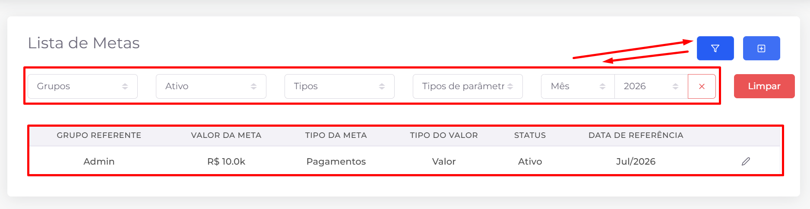
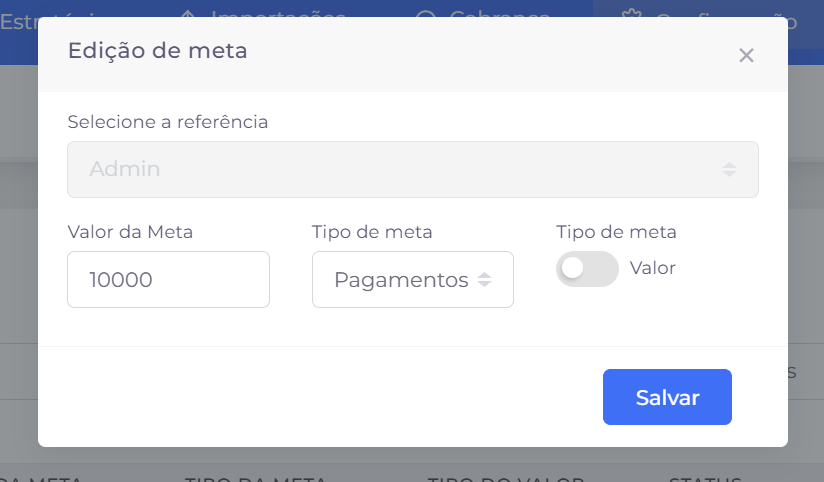

## 📌 Visão Geral

A tela de **Metas** permite consultar todas as metas cadastradas no sistema, exibindo informações como grupo vinculado, valor definido, tipo da meta, tipo do valor, status e período de referência.

Para facilitar a localização de registros, a tela disponibiliza filtros por grupo, status, tipo de meta, tipo de parâmetro e período de referência (mês e ano).

### Ações disponíveis

- **Filtro:** exibe ou oculta a área de filtros avançados da listagem.
- **Criar:** abre o formulário para cadastro de uma nova meta.
- **Editar:** permite alterar as informações de uma meta já cadastrada.
- **Limpar:** remove todos os filtros aplicados, restaurando a listagem completa.
- **Paginação:** quando houver muitas metas cadastradas, utilize o paginador localizado na parte inferior da tela para navegar entre as páginas de resultados.

## ➕ Criação e edição de metas

A criação e a edição de metas são realizadas pelo mesmo formulário. Nele são definidos o grupo de referência, o valor da meta, o tipo da meta e a forma como ela será mensurada.

Os principais campos disponíveis são:

- **Referência:** seleciona o grupo ao qual a meta será vinculada.
- **Valor da meta:** define o valor ou a quantidade que deverá ser atingida.
- **Tipo de meta:** determina o indicador que será acompanhado (por exemplo, **Pagamentos**).
- **Tipo da meta:** define como a meta será interpretada. As opções disponíveis são:
    - **Valor:** a meta será medida por um valor monetário.
    - **Quantidade:** a meta será medida pela quantidade de ocorrências ou registros.

Após preencher as informações desejadas, clique em **Salvar** para criar uma nova meta ou atualizar uma existente.

> **Observação:** Durante a criação, o grupo de referência é selecionado pelo usuário. Na edição, esse campo pode aparecer bloqueado para preservar a associação original da meta.
>