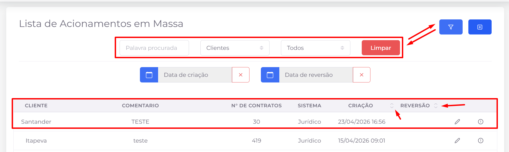
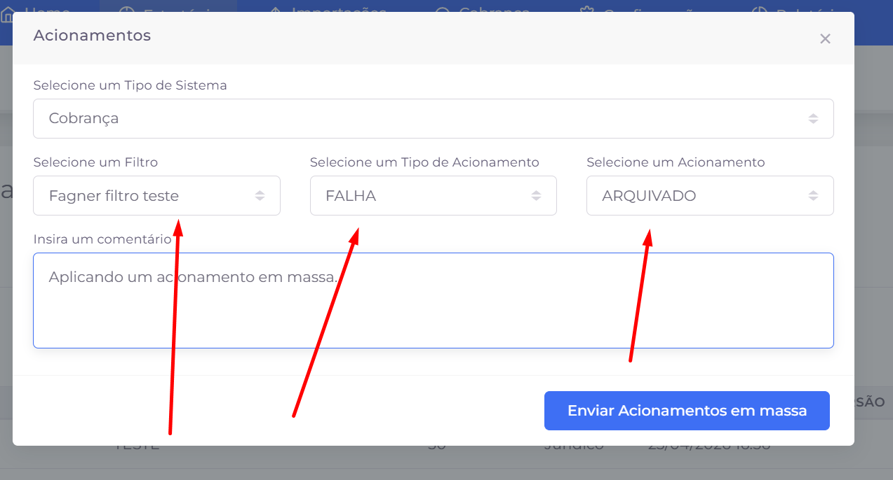

## 📌 Visão Geral

Os **acionamentos em massa** permitem aplicar um mesmo acionamento simultaneamente a diversos contratos. Essa funcionalidade é utilizada quando uma ação precisa ser registrada em um grande volume de contratos, eliminando a necessidade de realizar o procedimento individualmente.

## Listagem

A tela apresenta todos os acionamentos em massa cadastrados, permitindo localizar registros, acompanhar sua situação e realizar ações administrativas.

### Ações disponíveis

- **🔎 Filtro:** exibe ou oculta a área de filtros para facilitar a localização dos registros.
- **➕ Adicionar:** abre a tela para criação de um novo acionamento em massa.
- **↕ Ordenação:** as colunas **Criação** e **Reversão** permitem ordenar os registros em ordem crescente ou decrescente.
- **✏️ Editar:** disponibiliza as ações referentes ao acionamento em massa selecionado:
    - **Editar:** altera as configurações do acionamento em massa.
    - **Reverter:** remove o acionamento aplicado aos contratos vinculados ao registro.
- **📄 Paginação:** permite navegar entre as páginas da listagem quando houver grande quantidade de registros.

### Filtros disponíveis

Os registros podem ser localizados utilizando um ou mais dos seguintes filtros:

- **Palavra procurada:** pesquisa pelo comentário ou outras informações do registro.
- **Cliente:** exibe apenas os acionamentos em massa de um cliente específico.
- **Status:** filtra os registros conforme sua situação.
- **Data de criação:** restringe os resultados pelo período de criação do acionamento.
- **Data de reversão:** restringe os resultados pelo período em que ocorreu a reversão do acionamento.
- **Limpar:** remove todos os filtros aplicados e retorna à listagem completa.

### Informações exibidas

Para cada registro são apresentadas as seguintes informações:

- **Cliente**
- **Comentário**
- **Número de contratos afetados**
- **Sistema**
- **Data de criação**
- **Data de reversão** (quando houver)

> **Observação:** A reversão remove o acionamento aplicado aos contratos vinculados ao registro, restaurando o estado anterior desses contratos. Essa operação deve ser utilizada apenas quando houver necessidade de desfazer um acionamento realizado em massa.
> 

# Criação e edição

A criação e a edição de um acionamento em massa são realizadas na mesma tela. Nela, é possível definir quais contratos serão afetados, qual acionamento será aplicado e registrar um comentário que será gravado em todos os contratos selecionados.

## Campos disponíveis

- **Sistema:** define em qual módulo será aplicado o acionamento em massa, como Cobrança ou Jurídico.
- **Filtro:** seleciona o filtro previamente cadastrado que contém os contratos que receberão o acionamento.
- **Tipo de acionamento:** agrupa os acionamentos por categoria, facilitando sua localização.
- **Acionamento:** define qual acionamento será aplicado aos contratos retornados pelo filtro selecionado.
- **Comentário:** permite informar uma observação que será registrada juntamente com o acionamento em todos os contratos processados.

## Fluxo de utilização

Para criar um acionamento em massa:

1. Selecione o **Sistema**.
2. Escolha o **Filtro** que contém os contratos desejados.
3. Selecione o **Tipo de acionamento**.
4. Escolha o **Acionamento** que será aplicado.
5. Informe um **Comentário**, caso necessário.
6. Clique em **Enviar Acionamentos em Massa** para iniciar o processamento.

> **Observação:** O acionamento será aplicado a todos os contratos retornados pelo filtro selecionado. Antes de confirmar a operação, recomenda-se validar o filtro para garantir que apenas os contratos desejados sejam afetados, pois a ação pode impactar um grande volume de registros simultaneamente.
>