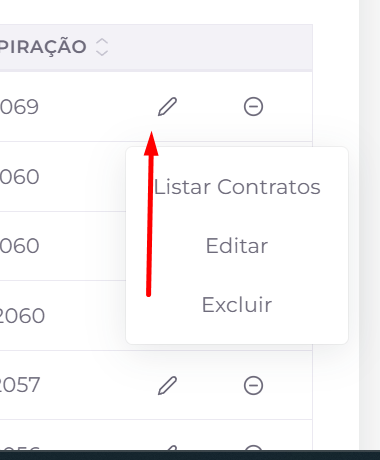

## 📌 Visão Geral

As campanhas são utilizadas para aplicar orientações, instruções ou restrições a um conjunto de contratos de forma centralizada. Em vez de registrar essa informação contrato por contrato, é possível selecionar um filtro ou uma planilha e criar uma campanha que será exibida automaticamente para os operadores nos contratos relacionados.

Esse recurso ajuda a padronizar o atendimento, facilitar a comunicação interna e garantir que regras importantes sejam aplicadas de forma consistente em grandes volumes de dados.

**Exemplo:** imagine um filtro com 1.000 contratos que não devem receber propostas de acordo. Em vez de editar cada contrato individualmente, basta criar uma campanha vinculada a esse filtro. Dessa forma, todos os contratos selecionados passam a exibir a campanha durante o atendimento.

## 🎯 Quando usar campanhas

As campanhas são indicadas quando você precisa:

- comunicar regras específicas aos operadores;
- aplicar instruções a vários contratos ao mesmo tempo;
- padronizar o tratamento de determinadas situações;
- garantir que uma informação importante seja exibida no momento do atendimento.

## 📋 Listagem de campanhas

A tela de campanhas exibe todas as campanhas cadastradas para o cliente selecionado, incluindo informações como origem, nome, peso, status, data de criação e data de expiração.

A área de filtros permite localizar campanhas específicas por cliente, módulo, nome, status e demais critérios disponíveis.

### Ações disponíveis

- **Filtro:** exibe ou oculta a área de filtros da listagem.
- **Criar:** abre o formulário para cadastro de uma nova campanha.
- **Menu de ações:** disponível no ícone de edição, reúne as opções abaixo:
  - **Listar contratos:** exibe todos os contratos que fazem parte da campanha.
  - **Editar:** permite alterar as informações da campanha.
  - **Excluir:** remove a campanha do sistema.
- **Alterar status:** ativa ou desativa a campanha, controlando sua disponibilidade para os operadores.
- **Limpar:** remove todos os filtros aplicados e restaura a listagem completa.
- **Paginação:** quando houver muitas campanhas cadastradas, utilize o paginador localizado na parte inferior da tela para navegar entre as páginas de resultados.

## ➕ Criação e edição de campanhas

A criação e a edição de campanhas são realizadas pelo mesmo formulário. Nele são definidos o conjunto de contratos que receberá a campanha, suas informações de identificação e o período em que permanecerá vigente.

### Campos principais

- **Sistema:** define o módulo no qual a campanha será utilizada, por exemplo Cobrança.
- **Filtro ou planilha:** seleciona o filtro ou a planilha que contém os contratos que farão parte da campanha.
- **Campanha predefinida:** permite utilizar um modelo de campanha previamente cadastrado, quando disponível.
- **Nome da campanha:** identifica a campanha que será exibida aos operadores durante o atendimento.
- **Data de expiração:** determina até quando a campanha permanecerá ativa.
- **Peso da campanha:** define a prioridade da campanha quando houver mais de uma associada ao mesmo contrato.
- **Valor da campanha:** permite informar um valor relacionado à campanha, quando aplicável.
- **Pop-up de confirmação:** quando habilitado, exibe uma confirmação ao operador antes de prosseguir com o atendimento do contrato.

Após configurar as informações desejadas, clique em **Salvar** para criar uma nova campanha ou atualizar uma existente.

## ⚠️ Regras importantes

As campanhas são estáticas. Isso significa que, após a criação, os contratos associados permanecem vinculados à campanha, mesmo que o filtro ou a planilha utilizada como origem seja alterado posteriormente. Para refletir mudanças no conjunto de contratos, é necessário criar uma nova campanha ou editar a campanha existente conforme a necessidade.
>