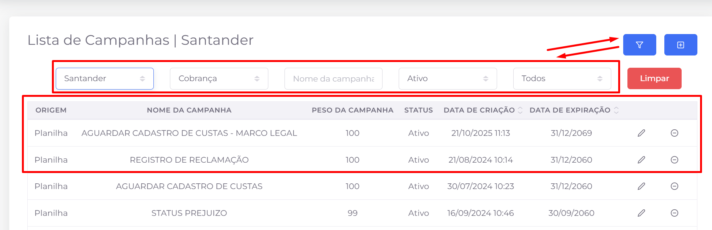
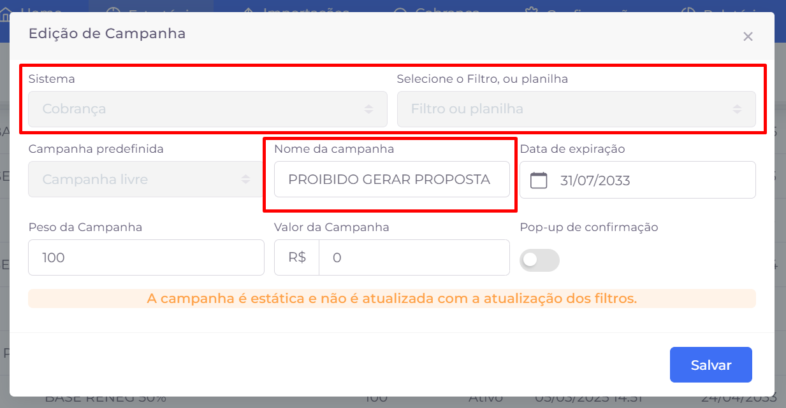

## 📌 Visão Geral

As **Campanhas** permitem aplicar instruções, restrições ou orientações a um conjunto de contratos de forma centralizada.

Em vez de acessar cada contrato individualmente para informar uma condição específica, é possível selecionar um filtro de contratos e criar uma campanha que será aplicada automaticamente a todos os registros retornados por esse filtro.

Esse recurso facilita a comunicação com os operadores e padroniza o tratamento de grandes volumes de contratos.

**Exemplo:** imagine um filtro contendo **1.000 contratos** que estão impedidos de receber propostas de acordo. Em vez de abrir cada contrato para registrar essa informação, basta criar uma campanha vinculada ao filtro. Assim, todos os contratos selecionados passam a exibir a campanha para os operadores durante o atendimento.

# 📋 Listagem de campanhas

A tela de **Campanhas** exibe todas as campanhas cadastradas para o cliente selecionado, apresentando informações como origem, nome da campanha, peso, status, data de criação e data de expiração.

A área de filtros permite localizar campanhas específicas por cliente, módulo, nome, status e demais critérios disponíveis.

### Ações disponíveis

- **Filtro:** exibe ou oculta a área de filtros da listagem.
- **Criar:** abre o formulário para cadastro de uma nova campanha.
- **Menu de ações:** disponível no ícone de edição, reúne as seguintes opções:
    - **Listar contratos:** exibe todos os contratos que fazem parte da campanha.
    - **Editar:** permite alterar as informações da campanha.
    - **Excluir:** remove a campanha do sistema.
- **Alterar status:** ativa ou desativa a campanha, controlando sua disponibilidade para os operadores.
- **Limpar:** remove todos os filtros aplicados e restaura a listagem completa.
- **Paginação:** quando houver muitas campanhas cadastradas, utilize o paginador localizado na parte inferior da tela para navegar entre as páginas de resultados.

![[ícone editar]](../img/estrategia/campanhas/image-1.png)

## ➕ Criação e edição de campanhas

A criação e a edição de campanhas são realizadas pelo mesmo formulário. Nele são definidos o conjunto de contratos que receberá a campanha, suas informações de identificação e o período em que permanecerá vigente.

Os principais campos disponíveis são:

- **Sistema:** define o módulo no qual a campanha será utilizada (por exemplo, Cobrança).
- **Filtro ou planilha:** seleciona o filtro ou a planilha que contém os contratos que farão parte da campanha.
- **Campanha predefinida:** permite utilizar um modelo de campanha previamente cadastrado, quando disponível.
- **Nome da campanha:** identifica a campanha que será exibida aos operadores durante o atendimento.
- **Data de expiração:** determina até quando a campanha permanecerá ativa.
- **Peso da campanha:** define a prioridade da campanha quando houver mais de uma associada ao mesmo contrato.
- **Valor da campanha:** permite informar um valor relacionado à campanha, quando aplicável.
- **Pop-up de confirmação:** quando habilitado, exibe uma confirmação ao operador antes de prosseguir com o atendimento do contrato.

Após configurar as informações desejadas, clique em **Salvar** para criar uma nova campanha ou atualizar uma existente.

> **Importante:** As campanhas são **estáticas**. Isso significa que, após sua criação, os contratos associados permanecem vinculados à campanha, mesmo que o filtro ou a planilha utilizada como origem seja alterado posteriormente. Para refletir alterações no conjunto de contratos, é necessário criar uma nova campanha ou editar a existente conforme a necessidade.
>