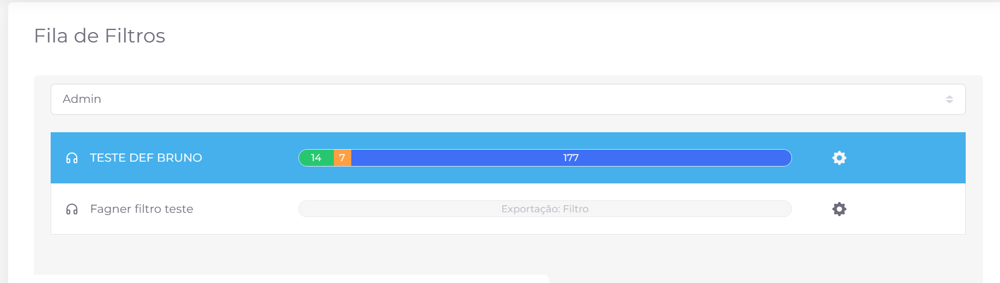
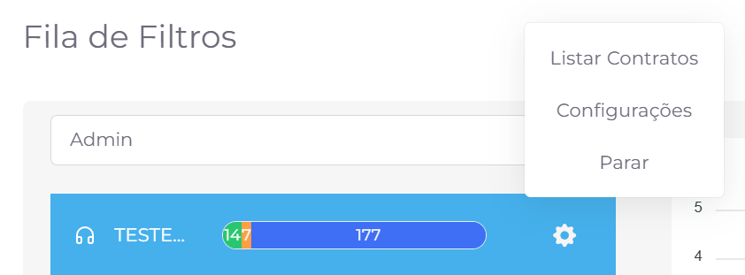

## 📌 Visão Geral

A tela **Fila de Filtros** permite acompanhar os filtros que estão em execução no sistema. Nela, é possível visualizar o andamento do processamento de cada filtro, acompanhar seu progresso e acessar configurações relacionadas à sua execução.

Após selecionar um **grupo**, o sistema exibe todos os filtros que estão em execução para esse grupo no momento da consulta.

Cada filtro apresenta uma barra de progresso que permite acompanhar o status do processamento dos contratos. As cores da barra representam a situação de cada contrato durante a execução do filtro:

- 🟢 **Verde:** Contratos concluídos.
- 🟡 **Amarelo:** Contratos em processamento.
- 🔵 **Azul:** Contratos pendentes de processamento.

**💡 Ordenação na Fila**

Os filtros são processados de acordo com a ordem em que aparecem na fila. Quando o processamento do primeiro filtro é concluído ou parado, o próximo filtro da lista assume automaticamente a primeira posição e inicia sua execução.

Ao clicar no ícone **⚙️ Configurações**, é exibido um menu com ações relacionadas ao filtro selecionado.

### 📄 Listar Contratos

Exibe, em uma janela modal, todos os contratos pertencentes ao filtro selecionado.

### ⚙️ Configurações

Permite acessar as configurações do filtro.

As opções disponíveis são:

- **Atualizar filtro:** Atualiza manualmente o filtro, sincronizando sua composição com a base de dados. Essa ação adiciona novos contratos que atendem aos critérios do filtro e remove aqueles que não fazem mais parte dele.
- **Filtro persistente:** Mantém o filtro ativo na fila, mesmo após a conclusão do processamento de todos os contratos. Essa opção é recomendada para filtros que precisam permanecer disponíveis para futuras atualizações.

### ⏹️ Parar

Interrompe a execução do filtro e o remove da fila de processamento.