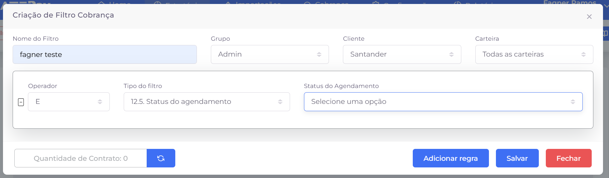
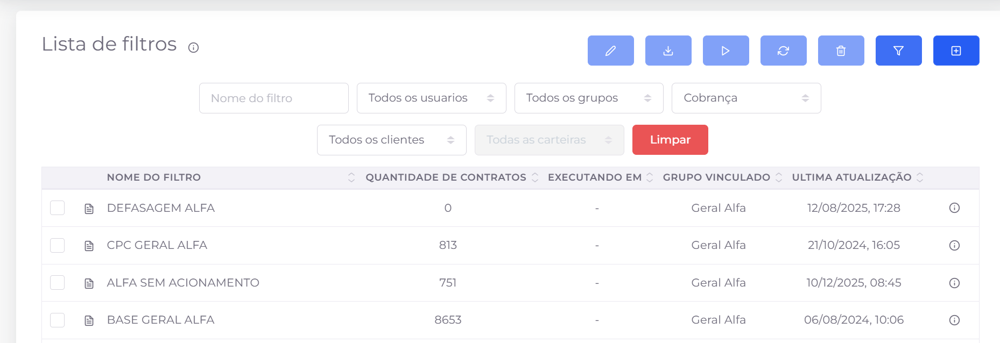
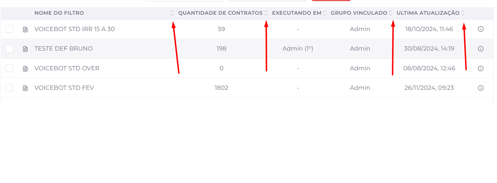

## 📌 Visão Geral

A tela de **Filtros** permite criar e gerenciar filtros que podem ser reutilizados em diferentes partes do sistema.

Esses filtros ajudam a **organizar e segmentar informações**, facilitando buscas e operações em massa.

# criação de filtro

### 🏷️ Nome do Filtro

**Descrição:** Define o nome que identificará o filtro dentro do sistema.

**Objetivo:** Facilitar a localização e a reutilização do filtro em outras funcionalidades.

**Obrigatório:** Sim.

### 👥 Grupo

**Descrição:** Define o(s) grupo(s) de usuários que poderão visualizar e utilizar o filtro.

**Objetivo:** Controlar quais grupos terão acesso ao filtro criado.

**Obrigatório:** Sim.

**Observação:** É possível vincular o filtro a um ou mais grupos.

### 🏢 Cliente

**Descrição:** Define o cliente ao qual o filtro será vinculado, como Santander, Banestes, entre outros.

**Objetivo:** Restringir a aplicação do filtro aos dados do cliente selecionado.

**Obrigatório:** Sim.

## 💼 Carteira

**Descrição:** Define a carteira que será considerada na aplicação do filtro.

**Objetivo:** Permitir que o filtro seja aplicado a uma carteira específica ou a todas as carteiras disponíveis.

**Obrigatório:** Sim.

## ⚙️ Operador

**Descrição:** Define a condição lógica utilizada na regra do filtro.

**Objetivo:** Determinar como o sistema irá comparar o valor informado.

**Operadores disponíveis:**

- É
- Não é
- Contém
- Maior que
- Menor que
- Entre

## 📋 Tipo do Filtro

**Descrição:** Define qual campo da base de dados será utilizado como critério da regra.

**Objetivo:** Especificar qual informação será analisada durante a execução do filtro.

**Exemplos:**

- Status do Agendamento
- Faixa de Atraso
- Cidade
- Estado
- Valor da Dívida

# Listagem de filtros

A tela **Listagem de Filtros** permite consultar e gerenciar todos os filtros cadastrados no sistema. A pesquisa pode ser realizada pelo nome do filtro, usuário, grupo, tipo de filtro, cliente e carteira, facilitando a localização de filtros específicos. 

## Parâmetros da Listagem

### 🏷️ Nome do filtro

Permite pesquisar um filtro pelo seu nome ou parte dele.

### 👤 Usuário

Filtra os registros pelo usuário responsável pela criação ou vinculação do filtro.

### 👥 Grupo

Exibe apenas os filtros vinculados ao grupo selecionado.

### 📋 Tipo

Permite filtrar os filtros conforme sua categoria, como **Cobrança** ou **Jurídico**.

### 🏢 Cliente

Restringe a listagem aos filtros pertencentes ao cliente selecionado.

### 💼 Carteira

Exibe apenas os filtros relacionados à carteira escolhida.

### ❌ Limpar

Remove todos os filtros aplicados e restaura a listagem completa.

# Colunas da listagem

- **Nome do Filtro**: Nome do filtro cadastrado.
- **Quantidade de Contratos**: Quantidade de contratos retornados pelo filtro.
- **Executando em**: Indica onde o filtro está sendo utilizado (caso aplicável).
- **Grupo Vinculado**: Grupo ao qual o filtro pertence.
- **Última Atualização**: Data e hora da última alteração realizada no filtro.

**💡 Ordenação**

As colunas que possuem o ícone de ordenação permitem classificar os registros em ordem crescente ou decrescente. Para alterar a ordem, clique na seta desejada ao lado do nome da coluna.

# **Ações Disponíveis**

### ✏️ Edição do filtro

Permite editar um filtro já cadastrado, possibilitando alterar suas informações e regras conforme a necessidade.

### 📄 Carregar contratos do filtro

Exibe todos os contratos retornados pelo filtro selecionado, permitindo visualizar os registros que atendem aos critérios definidos.

### 🔄 Atualizar filtro(s)

Atualiza manualmente os filtros selecionados. Como os filtros não são atualizados automaticamente quando há alterações na base de dados, é necessário executar essa ação para que a quantidade de contratos e os resultados reflitam as informações mais recentes.

### 🗑️ Excluir filtro

Remove permanentemente o filtro selecionado do sistema. Após a exclusão, o filtro não poderá mais ser utilizado.

### 🔍 Exibir/Ocultar filtros

Exibe ou oculta a área de pesquisa da listagem, permitindo mostrar ou esconder os campos utilizados para filtrar os registros.

### ➕ Criar filtro

Abre a janela de criação de um novo filtro, permitindo definir seus parâmetros, regras e demais configurações.