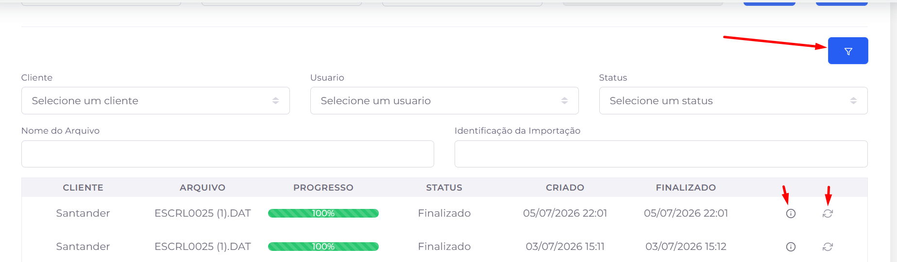

## 📌 Visão Geral

A tela **Importações** permite importar grandes volumes de dados para o sistema de forma rápida e organizada.

Antes de iniciar uma importação, o usuário deve selecionar o cliente, a carteira, o tipo de dado que será importado e o arquivo correspondente. Após o envio, a importação é processada pelo sistema e seu andamento pode ser acompanhado pela listagem disponível na própria tela.

.png)

.png)

.png)

### Contexto da Tela

A tela é dividida em duas áreas principais:

- **Importação de Arquivos:** utilizada para configurar e iniciar uma nova importação.
- **Listagem de Importações:** exibe as importações em andamento e o histórico das importações realizadas, permitindo acompanhar seu progresso e status.

# 📝 Campos

### 🏢 Cliente

**Descrição:** Define o cliente que receberá os dados importados.

**Obrigatório:** Sim.

---

### 💼 Carteira

**Descrição:** Define a carteira do cliente para a qual os dados serão importados.

**Obrigatório:** Sim.

### 📋 Tipo de Importação

**Descrição:** Define o tipo de informação que será importada para o sistema.

**Obrigatório:** Sim.

**Exemplos de tipos disponíveis:**

- Carga
- Endereços
- Contatos
- Parcelas
- Garantias
- Acordos
- Baixa de Pagamentos
- Batimento
- Processos Jurídicos
- Prévia do Acordo
- Quebra do Acordo

### 📑 Subtipo de Importação

**Descrição:** Permite selecionar um subtipo quando o tipo de importação possuir categorias específicas.

**Obrigatório:** Somente quando aplicável.

### 📎 Selecionar Arquivo

**Descrição:** Permite selecionar o arquivo que será enviado ao sistema para processamento.

**Obrigatório:** Sim.

**Observação:** O formato do arquivo pode variar de acordo com o tipo de importação (Excel, JSON, DAT ou outros formatos suportados).

# ⚙️ Ações Disponíveis

### 📎 Selecionar Arquivo

Abre o explorador de arquivos do computador para selecionar o arquivo que será importado.

---

### ⬆️ Importar

Inicia o envio do arquivo para o sistema e adiciona a importação à fila de processamento.

# 📋 Listagem de Importações

A **Listagem de Importações** permite acompanhar todas as importações realizadas no sistema, exibindo informações como cliente, arquivo importado, progresso do processamento, status da importação e datas de criação e conclusão.

Além de acompanhar o andamento das importações, a listagem disponibiliza ações para consultar informações detalhadas sobre cada processamento.

## 🔍 Filtros da Listagem

Para facilitar a localização de uma importação específica, a listagem permite realizar pesquisas utilizando diferentes critérios, como:

- 🏢 Cliente
- 👤 Usuário
- 📊 Status
- 📄 Nome do Arquivo
- 🆔 Identificação da Importação

## ⚙️ Ações Disponíveis

### 🔍 Exibir/Ocultar Filtros

Exibe ou oculta os campos de pesquisa da listagem, permitindo ampliar a área de visualização dos registros quando os filtros não estiverem sendo utilizados.

### ℹ️ Detalhes da Importação

Abre uma janela com o resumo completo da importação selecionada.

Nessa tela, é possível consultar informações como:

- Cliente;
- Usuário responsável pela importação;
- Nome do arquivo importado;
- Data de criação da importação;
- Data de conclusão;
- Status da importação;
- Progresso do processamento.

Além do resumo geral, a janela disponibiliza a aba **Detalhado**, que apresenta os resultados da importação organizados por tipo de registro, exibindo:

- **Total:** quantidade de registros processados.
- **Sucessos:** quantidade de registros importados com sucesso.
- **Falhas:** quantidade de registros que apresentaram erro durante a importação.

### 💡 Observação

Caso a importação apresente falhas, a aba **Detalhado** permite identificar quais tipos de registros foram afetados, facilitando a análise antes de realizar uma nova importação.