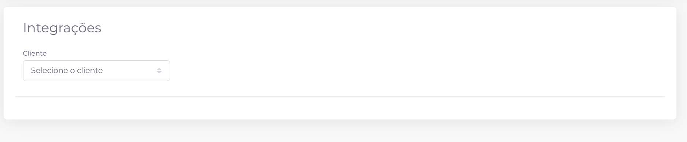
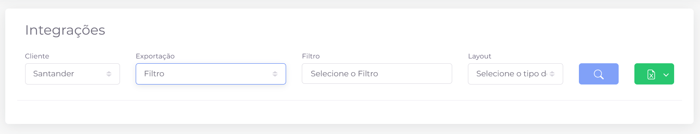

## 📌 Visão Geral

Apesar do nome **Integrações**, esta tela é destinada à **exportação de dados** para sistemas externos. A funcionalidade permite gerar arquivos a partir de filtros previamente cadastrados, utilizando layouts específicos para cada integração disponível.

O processo de exportação é realizado em três etapas:

1. Selecionar o **Cliente**.
2. Informar o tipo de **Exportação**, o **Filtro** desejado e o **Layout** de saída.
3. Configurar os parâmetros da exportação e gerar o arquivo.

## Exportação de dados

Após selecionar um cliente, ficam disponíveis os demais campos para configuração da exportação.

### Campos disponíveis

- **Cliente:** define para qual cliente será realizada a exportação.
- **Exportação:** seleciona o tipo de exportação disponível.
- **Filtro:** define quais contratos serão exportados.
- **Layout:** determina o formato do arquivo gerado.

### Ações disponíveis

- **🔍 Pesquisar:** consulta os dados com base nos filtros informados, validando a configuração antes da exportação.
- **📄 Exportar:** gera o arquivo no layout selecionado. Em alguns layouts, este botão apresenta uma seta lateral com opções adicionais de exportação.

## Configuração da exportação

Dependendo do layout escolhido, será exibido um modal para configuração dos parâmetros da exportação antes da geração do arquivo.

As configurações podem variar conforme o layout selecionado, mas normalmente incluem:

- **Tipo de telefone:** define quais telefones serão exportados.
- **Apenas telefones HOT:** exporta somente telefones classificados como HOT.
- **Limitar telefones:** habilita a limitação da quantidade de telefones exportados por contrato.
- **Quantidade de telefones por contrato:** informa o limite máximo de telefones quando a opção anterior estiver habilitada.
- **Score de / Score até:** permite definir uma faixa de score para selecionar apenas os telefones desejados.

### Ações disponíveis

- **Exportar:** inicia a geração do arquivo conforme as configurações informadas.

> **Observação:** Os layouts disponíveis, assim como os parâmetros de configuração, podem variar conforme o cliente e o tipo de integração configurado no sistema.
> 

